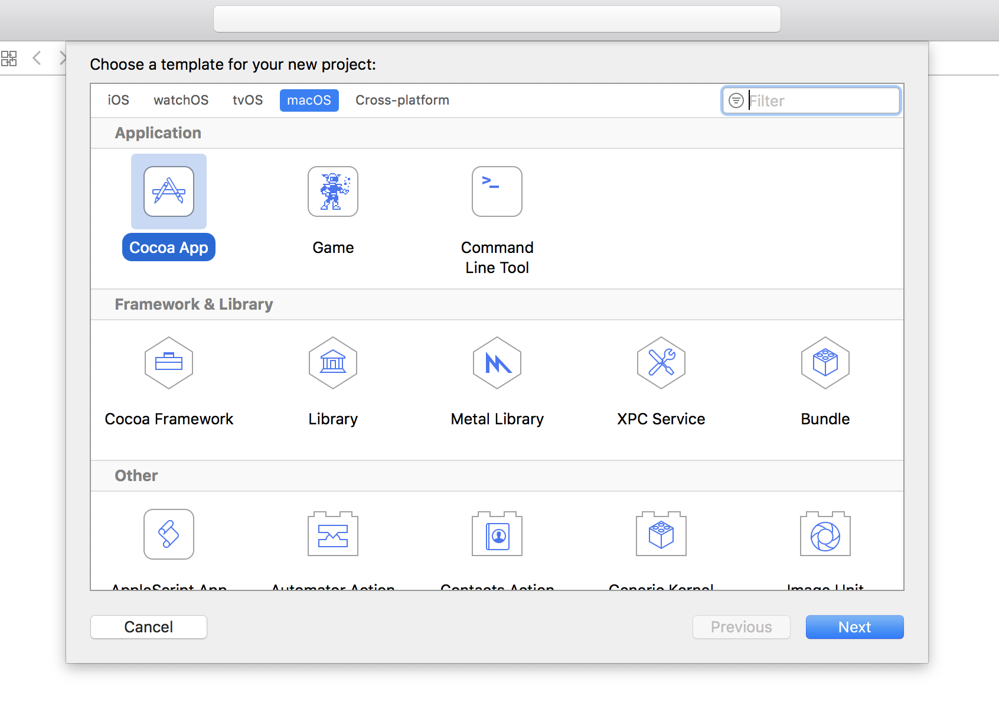
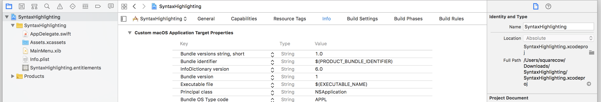
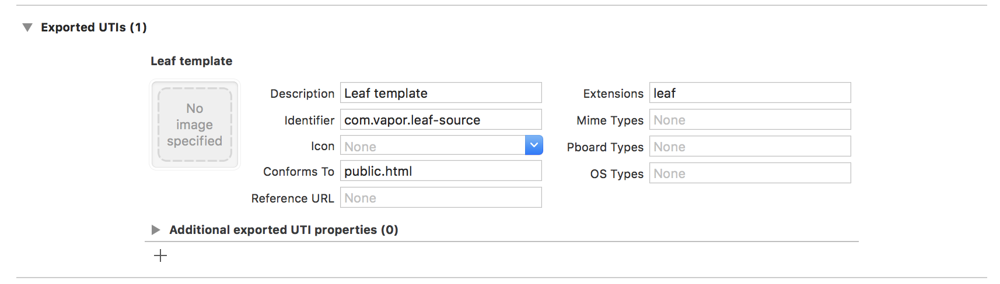

# Leaf

Leaf is a templating language that integrates with Futures, Reactive Streams and Codable. This section outlines how to import the Leaf package into a Vapor project.

## Example Folder Structure

```
Hello
├── Package.resolved
├── Package.swift
├── Public
├── Resources
│   ├── Views
│   │   └── hello.leaf
├── Public
│   ├── images (images resources)
│   ├── styles (css resources)
├── Sources
│   ├── App
│   │   ├── boot.swift
│   │   ├── configure.swift
│   │   └── routes.swift
│   └── Run
│       └── main.swift
├── Tests
│   ├── AppTests
│   │   └── AppTests.swift
│   └── LinuxMain.swift
└── LICENSE
```

## Adding Leaf to your project

The easiest way to use Leaf with Vapor is to include the Leaf repository as a dependency in Package.swift:

```swift
// swift-tools-version:4.0
import PackageDescription

let package = Package(
    name: "project1",
    dependencies: [
        // 💧 A server-side Swift web framework.
        .package(url: "https://github.com/vapor/vapor.git", .branch("beta")),
        .package(url: "https://github.com/vapor/leaf.git", .branch("beta")),
    ],
    targets: [
        .target(
            name: "App",
            dependencies: ["Vapor", "Leaf"]
        ),
        .target(name: "Run", dependencies: ["App"]),
        .testTarget(name: "AppTests", dependencies: ["App"]),
    ]
)
```

The Leaf package adds Leaf to your project, but to configure it for use you must modify configure.swift:

1. Add `import Leaf` to the top of the file so that Leaf is available to use. You will also need to add this to any file that will render templates.
2. Add `try services.register(LeafProvider())` to the `configure()` function so that routes may render Leaf templates as needed.


## Syntax Highlighting

You may also wish to install one these third-party packages that provide support for syntax highlighting in Leaf templates.

### Atom

[language-leaf](https://atom.io/packages/language-leaf) by ButkiewiczP

### Xcode

It is not currently possible to implement Leaf Syntax Highlighting in Xcode, however, using Xcode's HTML Syntax Coloring can help a bit. Select one or more Leaf files and then choose Editor > Syntax Coloring > HTML.  Your selected Leaf files will now use Xcode's HTML Syntax Coloring.  Unfortunately the usefulness of this is limited because this association will be removed when `vapor xcode` is run.

There is a way to make the syntax coloring persistant, but that requires a little bit more kung-fu. 

Follow the following steps:
1. Create a new macOS Application (⌘ + shift + n), choose Cocoa App and give it a nice name (doesn't matter what it is) and save it somewhere (doesnt matter too)



2. Select the target and go to the Info tab



3. Toggle Exported UTI's and click the + button below. Choose a nice description and fill the follow fields:
- Identifier (choose something thats unique)
- Conforms to (has to be public.html for html highlighting, see [this overview](https://developer.apple.com/library/content/documentation/Miscellaneous/Reference/UTIRef/Articles/System-DeclaredUniformTypeIdentifiers.html#//apple_ref/doc/uid/TP40009259) for more options)
- Extensions: leaf (no dot)



4. Now just run the app once and your choice will be persistant

*Based on [this](http://stackoverflow.com/questions/41961953/adding-syntax-coloring-to-xcode-for-unknown-file-extension-such-as-tcl) Stack Overflow answer*

### VS Code

[html-leaf](https://marketplace.visualstudio.com/items?itemName=Francisco.html-leaf) by FranciscoAmado

### CLion & AppCode

Some preliminary work has been done to implement a Leaf Plugin for CLion & AppCode but lack of skill and interest in Java has slowed progress! If you have IntelliJ SDK experience and want to help with this, message Tom Holland on [Vapor Slack](http://vapor.team)
