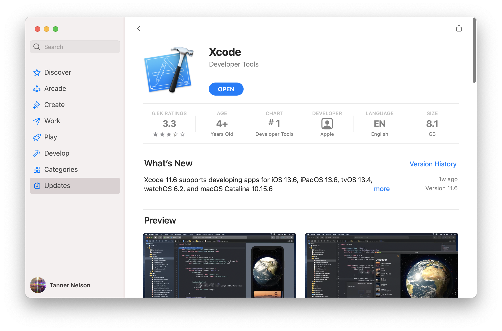

# Install on macOS

To use Vapor on macOS, you will need Swift 5.2 or greater. Swift and all of its dependencies come bundled with Xcode.

## Install Xcode

Install [Xcode 11.4 or greater](https://itunes.apple.com/us/app/xcode/id497799835?mt=12) from the Mac App Store.



After Xcode has been downloaded, you must open it to complete the installation. This may take a while.

Double check to ensure that the installation was successful by opening the Terminal and printing the Swift's version.

```sh
swift --version
```

You should see Swift's version information printed.

```sh
Apple Swift version 5.2 (swiftlang-1100.0.270.13 clang-1100.0.33.7)
Target: x86_64-apple-darwin19.0.0
```

Vapor 4 requires Swift 5.2 or greater.

## Install Toolbox

Now that you have Swift installed, let us install the [Vapor Toolbox](https://github.com/vapor/toolbox). This CLI tool is not required to use Vapor but it includes helpful utilities like a new project creator.

Toolbox is distributed via Homebrew. If you do not have Homebrew yet, visit <a href="https://brew.sh" target="_blank">brew.sh</a> for install instructions.

```sh
brew install vapor
```

Double check to ensure that the installation was successful by printing help.

```sh
vapor --help
```

You should see a list of available commands.

## Next

Now that you have installed Swift and Vapor Toolbox, create your first app in [Getting Started &rarr; Hello, world](../hello-world.md).
