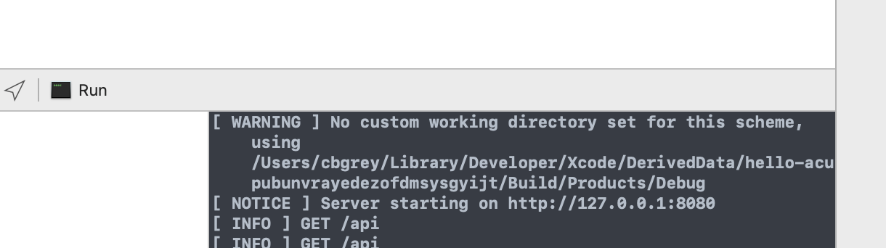
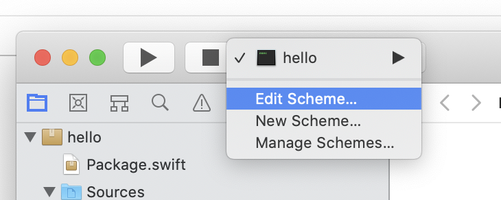
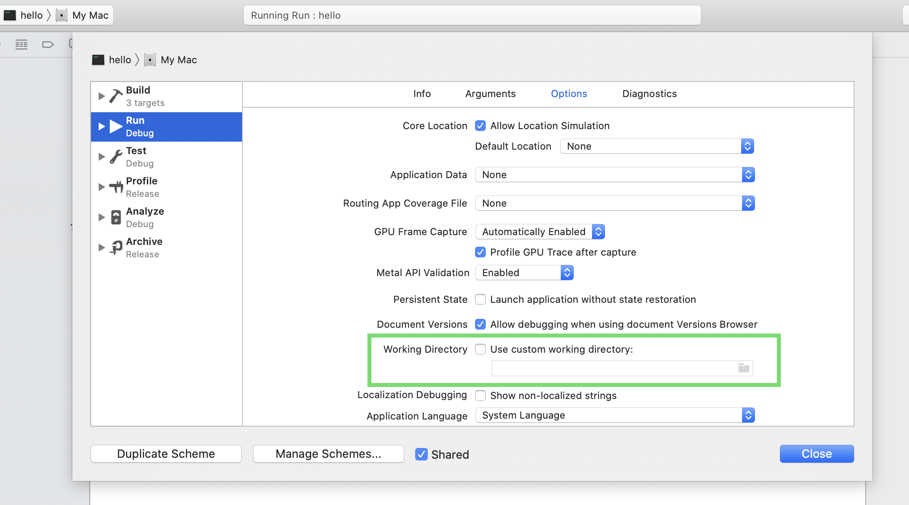
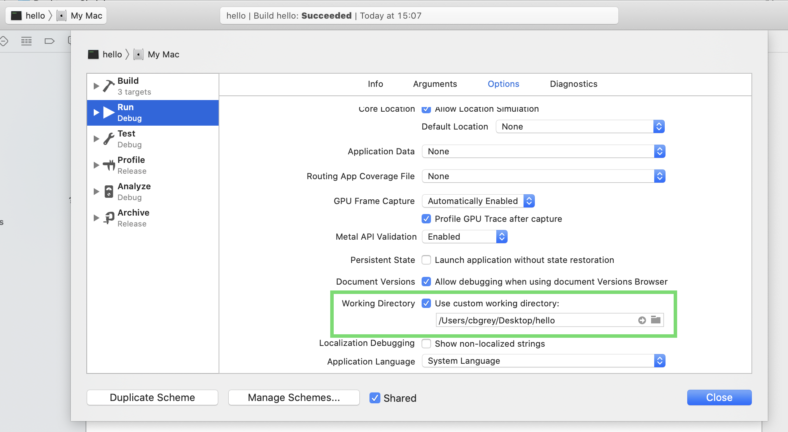

# Xcode

## Setting a Custom Working Directory
By default Xcode will reference a very obscure working directory called DerivedData for various assets which can cause significant problems or confusion. To avoid this, set a *Custom Working Directory* in the Xcode Scheme for your project. 

You will notice it is *not* set when you see this warning in the output: 

Edit the scheme and set it to your project's folder:  

Set the Custom Working directory...
(before)

(after)

Click "Close" to save the change. 
You will need to do this once for each Vapor project. 

