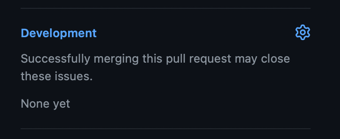

# Contribuer au projet Vapor

Vapor est un projet communautaire, et les contributions de ses membres représentent une proportion significative de ses développements. Ce guide vous présentera le processus de contribution pour vous aider dans vos premiers commits pour Vapor !

Toute contribution faite est utile ! Même de petites choses comme corriger des fautes de frappe font une grosse différence pour les utilisateurs de Vapor.

## Code de conduite

Vapor suit le code de conduite de Swift que vous pourrez retrouver sur [https://www.swift.org/code-of-conduct/](https://www.swift.org/code-of-conduct/). Nous attendons de chaque contributeur de suivre ce code de conduite.

## Sur quoi travailler

Savoir sur quoi travailler peut représenter un gros obstacle lorsque l'on débute dans l'open source ! En général, les meilleures choses sur lesquelles travailler seront les problèmes que vous rencontrerez ou les fonctionnalités que vous souhaiteriez avoir. Cependant, Vapor propose quelques choses pratiques pour vous aider dans vos contributions.

### Problèmes de sécurité

Si vous découvrez un problème de sécurité et souhaitez le signaler ou aider à le corriger, veuillez **ne pas** créer de ticket ou de Pull Request. Nous avons un processus à part pour les problèmes de sécurité afin de nous assurer que les vulnérabilités ne soient pas exposées tant qu'un correctif n'est pas disponible. Envoyez un email (de préférence en Anglais) à security@vapor.codes où [lisez ceci](https://github.com/vapor/.github/blob/main/SECURITY.md) pour plus d'informations.

### Problèmes mineurs

Si vous découvrez un problème mineur, bug ou faute de frappe, sentez-vous libre de créer une Pull Request pour le corriger. Si elle corrige un ticket ouvert sur un de nos dépots Git, vous pouvez le lier à la Pull Request dans la barre latérale pour clore automatiquement le ticket lorsque la Pull Request sera intégrée à la branche principale.

### Nouvelles fonctionnalités

Si vous voulez proposer des changements plus importants comme de nouvelles fonctionnalités ou correctifs impactant une quantité significative de code, veuillez au préalable soit ouvrir un ticket ou poster dans le canal `#development` de notre Discord (de préférence en Anglais). Cela nous permettra de discuter avec vous des modifications car il pourrait y avoir un contexte à prendre en compte, ou nous pourrions vous orienter dans la bonne direction. Nous ne souhaitons pas que vous perdiez du temps si une fonctionnalité n'entre pas dans nos plans !

### Les tableaux de Vapor

Si vous souhaitez contribuer sans pour autant avoir d'idée sur quoi, c'est super aussi ! Vapor a quelques tableaux qui peuvent aider. Vapor possède environ 40 dépots Git en développement actif et tous les parcourir pour trouver un sujet sur lequel travailler n'est pas pratique, alors nous utilisons des tableaux pour les aggréger.

Le premier tableau est celui des [bons premiers tickets](https://github.com/orgs/vapor/projects/14). Tout ticket de l'organisation GitHub Vapor taggé `good first issue` sera ajouté à ce tableau. Il s'agit de tickets qui, selon nous, seront accessibles aux utilisateurs relativement nouveaux sur Vapor, car ils ne nécessite pas beaucoup d'expérience de code.

Le deuxième tableau est celui des [demandes d'aide](https://github.com/orgs/vapor/projects/13). Il aggrège tout ticket taggé `help wanted`. Il s'agit de tickets qui ont besoin de correctif mais que la Core Team ne peut pas traiter à cause d'autres priorités. Ces tickets nécessitent généralement un peu plus d'expérience s'ils n'ont pas aussi le tag `good first issue`, mais ils peuvent représenter un projet fun sur lequel travailler !

### Traductions

Le dernier point sur lequel les contributions apportent beaucoup concerne la documentation. Celles-ci sont traduites dans plusieurs langues, mais toutes les pages ne sont pas traduites et nous aimerions avoir des traductions dans autant de langues que possible ! Si l'ajout de nouvelles traductions ou la mise à jour de celles existantes vous intéresse, consultez le [README de la documentation](https://github.com/vapor/docs#translating) ou contactez-nous sur le canal `#documentation` de notre Discord.

## Processus de contribution

Si vous n'avez pas encore travaillé sur un projet open source, les étapes de contribution peuvent paraître confuses, mais elles sont en réalité assez simples.

Tout d'abord, créez un fork de Vapor ou du dépot sur lequel vous souhaitez travailler. Vous pouvez le faire sur l'interface utilisateur GitHub, et GitHub a d'[excellentes documentations](https://docs.github.com/en/get-started/quickstart/fork-a-repo) expliquant comment faire.

Vous pouvez ensuite effectuer vos changements sur votre fork avec le processus habituel de commit et de push. Une fois que vous êtes prêt à soumettre votre correctif, vous pourrez créer une Pull Request vers le dépot Vapor. Ici encore, GitHub a d'[excellentes documentations](https://docs.github.com/en/pull-requests/collaborating-with-pull-requests/proposing-changes-to-your-work-with-pull-requests/creating-a-pull-request-from-a-fork) expliquant comment faire.

## Soumettre une Pull Request

Lorsque vous soumettez une Pull Request, vous aurez à vérifier plusieurs choses :

* Tous les tests doivent passer
* Vous devez ajouter des tests pour couvrir tout nouveau comportement ou bug corrigé
* Les nouvelles APIs doivent être documentées. Nous utilisons DocC pour cela.

Vapor utilise des automatisations pour réduire la quantité de travail nécessaire à de nombreuses tâches. Pour les Pull Requests, nous utilisons [Vapor Bot](https://github.com/VaporBot) pour générer des versions lors des intégrations. Le titre et la description de la Pull Request sont utilisés pour générer les notes de version, alors veuillez faire en sorte qu'ils soient clairs et couvrent ce que vous vous attendriez à voir dans les notes de version (veuillez les écrire en Anglais). Vous trouverez plus de détails dans nos [Guides de contributions de Vapor](https://github.com/vapor/vapor/blob/main/.github/contributing.md#release-title).
