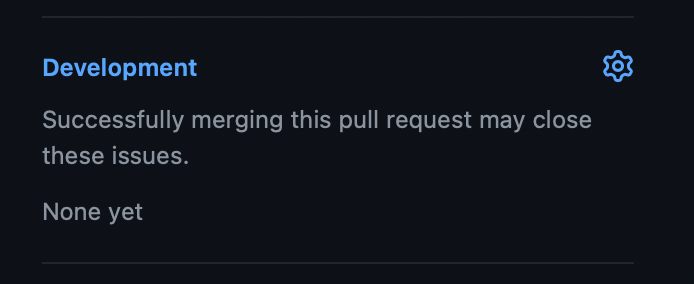

# Contribuindo com o Vapor

O Vapor é um projeto dirigido pela comunidade e contribuições de membros da comunidade formam uma parte significativa do desenvolvimento do Vapor. Este guia ajudará você a entender o processo de contribuição e a fazer seus primeiros commits no Vapor!

Qualquer contribuição que você faça é útil! Até pequenas coisas como corrigir erros de digitação fazem uma grande diferença para as pessoas que usam o Vapor.

## Code of Conduct

O Vapor adotou o Code of Conduct do Swift, que pode ser encontrado em [https://www.swift.org/code-of-conduct/](https://www.swift.org/code-of-conduct/). Espera-se que todos os contribuidores sigam o code of conduct.

## No que trabalhar

Descobrir no que trabalhar pode ser um grande obstáculo quando se trata de começar em open source! Geralmente, as melhores coisas para trabalhar são issues que você encontra ou funcionalidades que você quer. No entanto, o Vapor tem algumas coisas úteis para ajudar você a contribuir.

### Problemas de Segurança

Se você descobrir um problema de segurança e quiser reportá-lo ou ajudar a corrigi-lo, por favor **não** abra uma issue ou crie um pull request. Temos um processo separado para problemas de segurança para garantir que não exponhamos vulnerabilidades até que uma correção esteja disponível. Envie um e-mail para security@vapor.codes ou [veja aqui](https://github.com/vapor/.github/blob/main/SECURITY.md) para mais detalhes.

### Pequenas issues

Se você encontrar uma pequena issue, bug ou erro de digitação, sinta-se à vontade para ir em frente e criar um pull request para corrigir. Se isso resolver uma issue aberta em algum dos repositórios, você pode vinculá-la no pull request na barra lateral para que a issue seja automaticamente fechada quando o pull request for mergeado.

### Novas funcionalidades

Se você quiser propor mudanças maiores como novas funcionalidades ou correções de bugs que alteram quantidades significativas de código, por favor abra uma issue primeiro ou poste no canal `#development` no Discord. Isso nos permite discutir a mudança com você, pois pode haver algum contexto que precisamos aplicar ou podemos dar dicas. Não queremos que você perca tempo se uma funcionalidade não se encaixa nos nossos planos!

### Boards do Vapor

Se você quer contribuir mas não tem uma ideia do que trabalhar, isso é ótimo! O Vapor tem alguns boards que podem ajudar. O Vapor tem cerca de 40 repositórios que são ativamente desenvolvidos e procurar em todos eles para encontrar algo para trabalhar não é prático, então usamos boards para agregá-los.

O primeiro board é o [good first issue board](https://github.com/orgs/vapor/projects/14). Qualquer issue na organização do Vapor no GitHub que esteja marcada com `good first issue` será adicionada ao board para você encontrar. São issues que achamos que serão boas para pessoas relativamente novas no Vapor trabalharem, pois não requerem muita experiência com o código.

O segundo board é o [help wanted board](https://github.com/orgs/vapor/projects/13). Ele puxa issues marcadas com `help wanted`. São issues que podem ser boas de corrigir, mas o time core atualmente tem outras prioridades. Essas issues geralmente requerem um pouco mais de conhecimento se não estiverem também marcadas com `good first issue`, mas podem ser projetos divertidos para trabalhar!

### Traduções

A área final onde contribuições são extremamente valiosas é a documentação. Os docs têm traduções para múltiplos idiomas, mas nem toda página está traduzida e há muitos mais idiomas que gostaríamos de suportar! Se você tem interesse em contribuir com novos idiomas ou atualizações, veja o [README dos docs](https://github.com/vapor/docs#translating) ou entre em contato no canal `#documentation` no Discord.

## Processo de Contribuição

Se você nunca trabalhou em um projeto open source, os passos para realmente contribuir podem ser confusos, mas são bem simples.

Primeiro, faça um fork do Vapor ou de qualquer repositório em que você queira trabalhar. Você pode fazer isso na interface do GitHub e o GitHub tem [documentação excelente](https://docs.github.com/en/get-started/quickstart/fork-a-repo) sobre como fazer isso.

Você pode então fazer mudanças no seu fork com o processo usual de commit e push. Quando estiver pronto para submeter sua correção, pode criar um PR para o repositório do Vapor. Novamente, o GitHub tem [documentação excelente](https://docs.github.com/en/pull-requests/collaborating-with-pull-requests/proposing-changes-to-your-work-with-pull-requests/creating-a-pull-request-from-a-fork) sobre como fazer isso.

## Submetendo um Pull Request

Ao submeter um pull request, há várias coisas que você deve verificar:

* Todos os testes passam
* Novos testes adicionados para qualquer novo comportamento ou bugs corrigidos
* Novas APIs públicas estão documentadas. Usamos DocC para nossa documentação de API.

O Vapor usa automação para reduzir a quantidade de trabalho necessário para muitas tarefas. Para pull requests, usamos o [Vapor Bot](https://github.com/VaporBot) para gerar releases quando um pull request é mergeado. O corpo e título do pull request são usados para gerar as notas de release, então certifique-se de que façam sentido e cubram o que você esperaria ver em notas de release. Temos mais detalhes nas [diretrizes de contribuição do Vapor](https://github.com/vapor/vapor/blob/main/.github/contributing.md#release-title).
