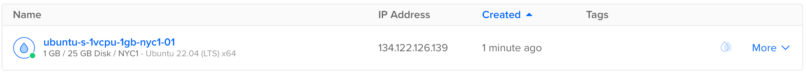

# Deploy su DigitalOcean

Questa guida ti accompagnerà nel deploy di una semplice applicazione Vapor "Hello, world" su un [Droplet](https://www.digitalocean.com/products/droplets/). Per seguire questa guida, è necessario avere un account [DigitalOcean](https://www.digitalocean.com) con la fatturazione configurata.

## Creare il Server

Iniziamo installando Swift su un server Linux. Usa il menu di creazione per creare un nuovo Droplet.


Nella sezione distribuzioni, seleziona Ubuntu 22.04 LTS. La guida seguente utilizzerà questa versione come esempio.


!!! note "Nota"
	Puoi selezionare qualsiasi distribuzione Linux con una versione supportata da Swift. Puoi verificare quali sistemi operativi sono ufficialmente supportati nella pagina [Swift Releases](https://swift.org/download/#releases).

Dopo aver selezionato la distribuzione, scegli il piano e la regione del datacenter che preferisci. Quindi configura una chiave SSH per accedere al server dopo la sua creazione. Infine, clicca su "Create Droplet" e attendi che il nuovo server si avvii.

Quando il nuovo server è pronto, passa il cursore sull'indirizzo IP del Droplet e clicca su copia.



## Configurazione Iniziale

Apri il terminale e connettiti al server come root tramite SSH.

```sh
ssh root@your_server_ip
```

DigitalOcean ha una guida dettagliata per la [configurazione iniziale del server su Ubuntu 22.04](https://www.digitalocean.com/community/tutorials/initial-server-setup-with-ubuntu-22-04). Questa guida coprirà rapidamente le basi.

### Configurare il Firewall

Consenti OpenSSH attraverso il firewall e abilitalo.

```sh
ufw allow OpenSSH
ufw enable
```

### Aggiungere un Utente

Crea un nuovo utente oltre a `root`. Questa guida chiama il nuovo utente `vapor`.

```sh
adduser vapor
```

Consenti al nuovo utente di usare `sudo`.

```sh
usermod -aG sudo vapor
```

Copia le chiavi SSH autorizzate dell'utente root nel nuovo utente. Questo ti permetterà di accedere via SSH come nuovo utente.

```sh
rsync --archive --chown=vapor:vapor ~/.ssh /home/vapor
```

Infine, esci dalla sessione SSH corrente e accedi come nuovo utente.

```sh
exit
ssh vapor@your_server_ip
```

## Installare Swift

Ora che hai creato un nuovo server Ubuntu e hai effettuato l'accesso come utente non-root, puoi installare Swift.

### Installazione automatica tramite lo strumento CLI Swiftly (consigliata)

Visita il [sito di Swiftly](https://swiftlang.github.io/swiftly/) per le istruzioni su come installare Swiftly e Swift su Linux. Successivamente, installa Swift con il seguente comando:

#### Utilizzo di base

```sh
$ swiftly install latest

Fetching the latest stable Swift release...
Installing Swift 5.9.1
Downloaded 488.5 MiB of 488.5 MiB
Extracting toolchain...
Swift 5.9.1 installed successfully!

$ swift --version

Swift version 5.9.1 (swift-5.9.1-RELEASE)
Target: x86_64-unknown-linux-gnu
```

## Installazione di Vapor tramite la Vapor Toolbox

Ora che Swift è installato, installiamo Vapor usando il Vapor Toolbox. Dovrai compilare il toolbox dal sorgente. Consulta le [release](https://github.com/vapor/toolbox/releases) del toolbox su GitHub per trovare la versione più recente. In questo esempio usiamo la 18.6.0.

### Clonare e compilare Vapor

Clona il repository del Vapor Toolbox.

```sh
git clone https://github.com/vapor/toolbox.git
```

Passa all'ultima release.

```sh
cd toolbox
git checkout 18.6.0
```

Compila Vapor e sposta il binario nel tuo path.

```sh
swift build -c release --disable-sandbox --enable-test-discovery
sudo mv .build/release/vapor /usr/local/bin
```

### Creare un Progetto Vapor

Usa il comando new del Toolbox per inizializzare un progetto.

```sh
vapor new HelloWorld -n
```

!!! tip "Suggerimento"
	Il flag `-n` ti fornisce un template minimale rispondendo automaticamente no a tutte le domande.


Una volta completato il comando, entra nella cartella appena creata:

```sh
cd HelloWorld
```

### Aprire la Porta HTTP

Per poter accedere a Vapor sul tuo server, apri una porta HTTP.

```sh
sudo ufw allow 8080
```

### Avviare

Ora che Vapor è configurato e abbiamo una porta aperta, avviamolo.

```sh
swift run App serve --hostname 0.0.0.0 --port 8080
```

Visita l'IP del tuo server tramite browser o terminale locale e dovresti vedere "It works!". In questo esempio l'indirizzo IP è `134.122.126.139`.

```
$ curl http://134.122.126.139:8080
It works!
```

Sul tuo server dovresti vedere i log per la richiesta di test.

```
[ NOTICE ] Server starting on http://0.0.0.0:8080
[ INFO ] GET /
```

Usa `CTRL+C` per fermare il server. Potrebbe richiedere un momento per lo spegnimento.

Congratulazioni per aver avviato la tua app Vapor su un Droplet di DigitalOcean!

## Prossimi Passi

Il resto di questa guida rimanda a risorse aggiuntive per migliorare il tuo deploy.

### Supervisor

Supervisor è un sistema di controllo dei processi che può avviare e monitorare il tuo eseguibile Vapor. Con Supervisor configurato, la tua app può avviarsi automaticamente all'avvio del server e riavviarsi in caso di crash. Scopri di più su [Supervisor](../deploy/supervisor.it.md).

### Nginx

Nginx è un server HTTP e proxy estremamente veloce, collaudato e facile da configurare. Mentre Vapor supporta la gestione diretta delle richieste HTTP, fare il proxy dietro Nginx può fornire migliori prestazioni, sicurezza e facilità d'uso. Scopri di più su [Nginx](../deploy/nginx.it.md).
