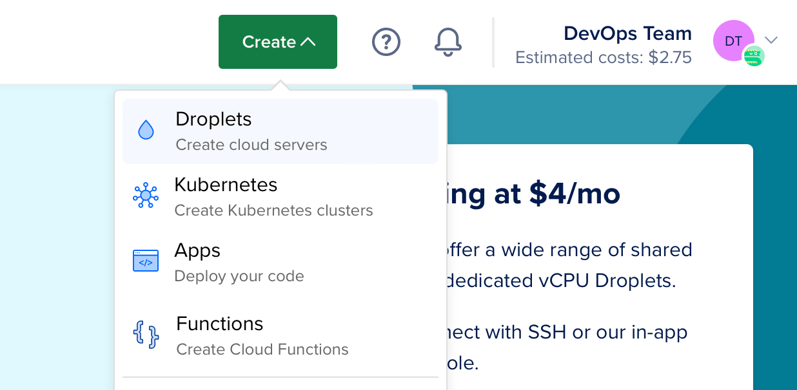
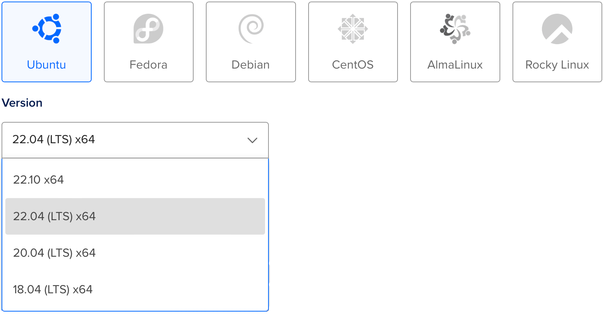
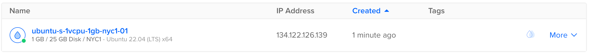
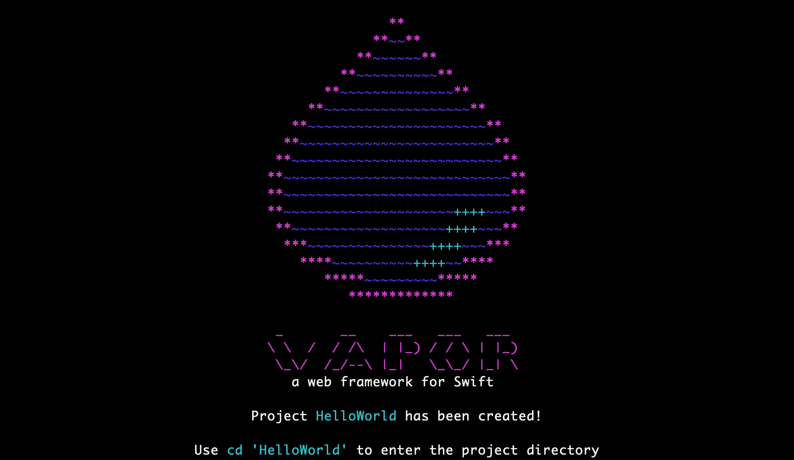

# Deployen naar DigitalOcean

Deze handleiding leidt u door het implementeren van een eenvoudige Hello, world Vapor applicatie op een [Droplet](https://www.digitalocean.com/products/droplets/). Om deze gids te volgen, heeft u een [DigitalOcean](https://www.digitalocean.com) account nodig met geconfigureerde facturering.

## Maak Server Aan

Laten we beginnen met het installeren van Swift op een Linux server. Gebruik het create menu om een nieuwe Droplet aan te maken.



Onder distributies, selecteer Ubuntu 22.04 LTS. De volgende gids zal deze versie als voorbeeld gebruiken.



!!! note  "Opmerking"
    U kunt elke Linux distributie kiezen met een versie die Swift ondersteunt. U kunt controleren welke besturingssystemen officieel worden ondersteund op de [Swift Releases](https://swift.org/download/#releases) pagina.

Na het selecteren van de distributie, kies een plan en datacenter regio van uw voorkeur. Stel dan een SSH sleutel in om toegang te krijgen tot de server nadat deze is aangemaakt. Klik tenslotte op Droplet aanmaken en wacht tot de nieuwe server is opgestart.

Als de nieuwe server klaar is, ga dan met de muis over het IP adres van de Droplet en klik op kopiëren.



## Initiële Instelling

Open uw terminal en maak verbinding met de server als root met SSH.

```sh
ssh root@your_server_ip
```

DigitalOcean heeft een diepgaande gids voor [initiële serverinstallatie op Ubuntu 22.04](https://www.digitalocean.com/community/tutorials/initial-server-setup-with-ubuntu-22-04). Deze gids zal snel de basis behandelen.

### Configureer Firewall

Sta OpenSSH toe door de firewall en schakel het in.

```sh
ufw allow OpenSSH
ufw enable
```

### Voeg Gebruiker Toe

Maak een nieuwe gebruiker aan naast `root`. Deze handleiding noemt de nieuwe gebruiker `vapor`.

```sh
adduser vapor
```

Sta de nieuw aangemaakte gebruiker toe `sudo` te gebruiken.

```sh
usermod -aG sudo vapor
```

Kopieer de geautoriseerde SSH sleutels van de root gebruiker naar de nieuw aangemaakte gebruiker. Dit zal u toelaten om in te SSH-en als de nieuwe gebruiker.

```sh
rsync --archive --chown=vapor:vapor ~/.ssh /home/vapor
```

Verlaat tenslotte de huidige SSH-sessie en meld u aan als de nieuw aangemaakte gebruiker. 

```sh
exit
ssh vapor@your_server_ip
```

## Installeer Swift

Nu dat je een nieuwe Ubuntu server hebt aangemaakt en ingelogd bent als een niet-root gebruiker kan je Swift installeren. 

### Geautomatiseerde installatie met de Swiftly CLI-tool (aanbevolen)

Bezoek de [Swiftly website](https://swiftlang.github.io/swiftly/) voor instructies over het installeren van Swiftly en Swift op Linux. Installeer daarna Swift met het volgende commando:

#### Basisgebruik

```sh
$ swiftly install latest

Fetching the latest stable Swift release...
Installing Swift 5.9.1
Downloaded 488.5 MiB of 488.5 MiB
Extracting toolchain...
Swift 5.9.1 installed successfully!

$ swift --version

Swift version 5.9.1 (swift-5.9.1-RELEASE)
Target: x86_64-unknown-linux-gnu
```

## Installeer Vapor met de Vapor Toolbox

Nu Swift geïnstalleerd is, laten we Vapor installeren door de Vapor Toolbox te gebruiken. U moet via de broncode de toolbox bouwen. Bekijk de toolbox [releases](https://github.com/vapor/toolbox/releases) op Github om de laatste versie te vinden. In dit voorbeeld gebruiken we versie 18.6.0.

### Clone & Build Vapor

Kloon de Vapor Toolbox repository
```sh
git clone https://github.com/vapor/toolbox.git
```

Haal de laatste release op.

```sh
cd toolbox
git checkout 18.6.0
```

Bouw Vapor en verplaats de binary in je pad.

```sh
swift build -c release --disable-sandbox --enable-test-discovery
sudo mv .build/release/vapor /usr/local/bin
```

### Maak een Vapor Project

Gebruik het `new` commando van de Toolbox om een nieuw project aan te maken

```sh
vapor new HelloWorld -n
```

!!! tip
    De `-n` vlag geeft je een barebones sjabloon door automatisch nee te antwoorden op alle vragen



Eens het commando gedaan is kan je naar de nieuw gemaakte folder gaan:

```sh
cd HelloWorld
```

### Open HTTP Port

Om je Vapor applicatie te kunnen gebruiken, moet je een HTTP poort openzetten.

```sh
sudo ufw allow 8080
```

### Run

Nu dat Vapor klaar is en we een open poort hebben, laten we het commando runnen.

```sh
swift run App serve --hostname 0.0.0.0 --port 8080
```

Bezoek de IP van uw server via een browser of lokale terminal en u zou moeten zien "It works!". Het IP address in dit voorbeeld is `134.122.126.139`.

```
$ curl http://134.122.126.139:8080
It works!
```

Terug op je server, zou je logs moeten zien voor het test verzoek.

```
[ NOTICE ] Server starting on http://0.0.0.0:8080
[ INFO ] GET /
```

Gebruik `CTRL+C` om de server af te sluiten. Het afsluiten kan even duren.

Gefeliciteerd met het draaien van uw Vapor app op een DigitalOcean Droplet!

## Volgende Stappen

De rest van deze gids verwijst naar aanvullende bronnen om uw inzet te verbeteren. 

### Supervisor

Supervisor is een procescontrolesysteem dat uw Vapor executable kan draaien en bewaken. Met de setup van supervisor kan uw app automatisch starten wanneer de server opstart en herstart worden in geval van een crash. Meer informatie over [Supervisor](../deploy/supervisor.md).

### Nginx

Nginx is een extreem snelle, in de strijd geteste, en eenvoudig te configureren HTTP server en proxy. Hoewel Vapor het direct serveren van HTTP verzoeken ondersteunt, kan proxying achter Nginx voor betere prestaties, veiligheid en gebruiksgemak zorgen. Leer meer over [Nginx](../deploy/nginx.md).
