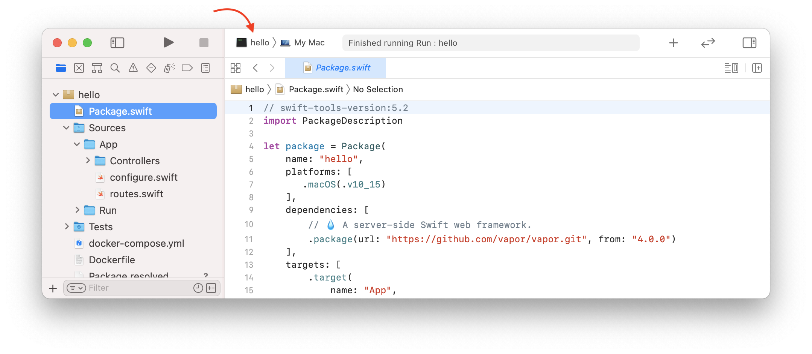
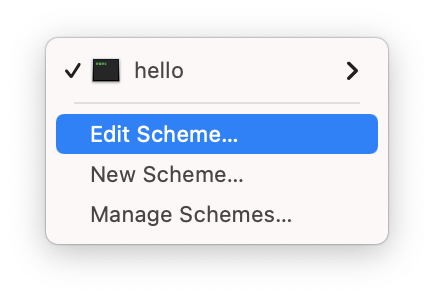
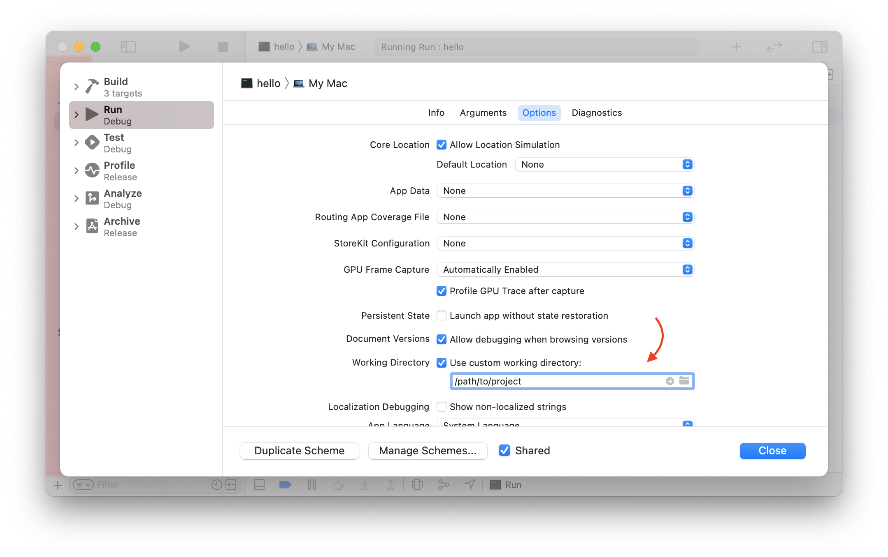

# Xcode

Dieser Abschnitt geht auf Tipps und Tricks zur Verwendung von Xcode ein. Solltest du eine andere Entwicklungsumgebung verwenden, kannst du den Abschnitt überspringen.

## Eigenes Arbeitsverzeichnis

Standardmäßig führt Xcode dein Projekt aus dem Ordner _DerivedData_ aus. Dieser Ordner ist nicht identisch mit dem Stammverzeichnis deines Projekts (in dem sich deine Datei _Package.swift_ befindet). Das bedeutet, dass Vapor Dateien und Ordner wie _.env_ oder _Public_ nicht finden kann.

Du erkennst dieses Problem daran, dass beim Ausführen deiner App die folgende Warnung angezeigt wird.

```fish
[ WARNING ] No custom working directory set for this scheme, using /path/to/DerivedData/project-abcdef/Build/
```

Um das zu beheben, lege im Xcode-Schema deines Projekts ein benutzerdefiniertes Arbeitsverzeichnis fest.

Bearbeite zunächst das Schema deines Projekts, indem du auf die Schema-Auswahl neben den Play- und Stopp-Schaltflächen klickst.



Wähle im Dropdown-Menü _Edit Scheme..._ aus.



Wähle im Schema-Editor die Aktion _App_ und den Tab _Options_ aus. Aktiviere _Use custom working directory_ und gib den Pfad zum Stammverzeichnis deines Projekts an.



Den vollständigen Pfad zum Stammverzeichnis deines Projekts erhältst du, indem du `pwd` in einem Terminal-Fenster ausführst, das dort geöffnet ist.

```sh
# get path to this folder
pwd
```

Du solltest eine Ausgabe ähnlich der folgenden sehen.

```
/path/to/project
```
