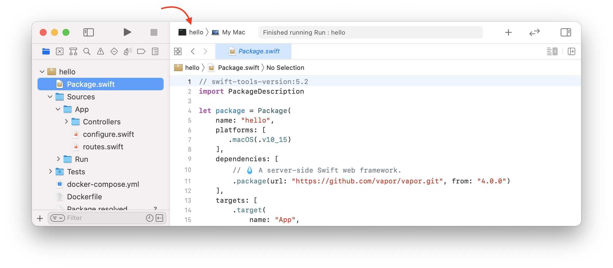
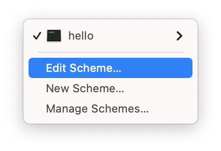
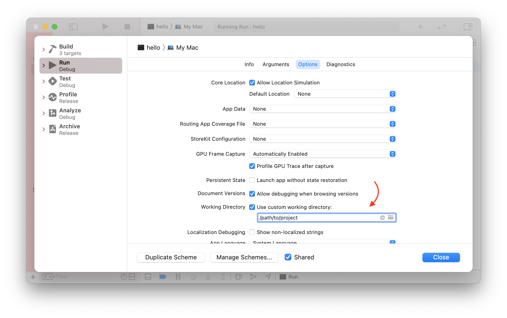

# Xcode

Esta página apresenta algumas dicas e truques para usar o Xcode. Se você usa um ambiente de desenvolvimento diferente, pode pular esta seção.

## Diretório de Trabalho Personalizado

Por padrão, o Xcode executará seu projeto a partir da pasta _DerivedData_. Essa pasta não é a mesma que a pasta raiz do seu projeto (onde o arquivo _Package.swift_ está). Isso significa que o Vapor não conseguirá encontrar arquivos e pastas como _.env_ ou _Public_.

Você pode perceber isso se vir o seguinte aviso ao executar sua aplicação.

```fish
[ WARNING ] No custom working directory set for this scheme, using /path/to/DerivedData/project-abcdef/Build/
```

Para corrigir isso, defina um diretório de trabalho personalizado no scheme do Xcode para seu projeto.

Primeiro, edite o scheme do seu projeto clicando no seletor de scheme ao lado dos botões play e stop.



Selecione _Edit Scheme..._ no menu suspenso.



No editor de scheme, escolha a ação _App_ e a aba _Options_. Marque _Use custom working directory_ e insira o caminho para a pasta raiz do seu projeto.



Você pode obter o caminho completo da pasta raiz do seu projeto executando `pwd` em uma janela do terminal aberta nela.

```sh
# obter o caminho desta pasta
pwd
```

Você deverá ver uma saída similar à seguinte.

```
/caminho/do/projeto
```
