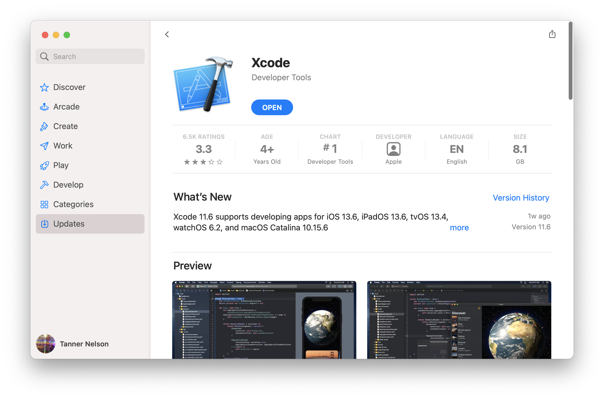

# Installation sur macOS

Pour utiliser Vapor sur macOS, vous aurez besoin de Swift 5.9 ou plus. Swift et toutes ses dépendances sont installées avec Xcode.

## Installer Xcode

Installer [Xcode](https://itunes.apple.com/us/app/xcode/id497799835?mt=12) depuis le Mac App Store.



Une fois Xcode téléchargé, ouvrez-le pour terminer son installation. Cette étape peut prendre un certain temps.

Vérifiez que l'installation a réussi en ouvrant un Terminal et en affichant la version de Swift.

```sh
swift --version
```

Vous devriez voir les informations de version de Swift affichées.

```sh
swift-driver version: 1.75.2 Apple Swift version 5.8 (swiftlang-5.8.0.124.2 clang-1403.0.22.11.100)
Target: arm64-apple-macosx13.0
```

Vapor 4 nécessite Swift 5.9 ou plus.

## Installer la Toolbox

Maintenant que Swift est installé, installons la [Toolbox Vapor](https://github.com/vapor/toolbox). Cet outil en lignes de commandes n'est pas nécessaire pour utiliser Vapor, mais il aide à créer de nouveaux projets.

### Homebrew

La Toolbox est distribuée via Homebrew. Si vous n'avez pas encore Homebrew, rendez-vous sur <a href="https://brew.sh" target="_blank">brew.sh</a> pour suivre les instructions d'installation.

```sh
brew install vapor
```

Vérifiez que l'installation a bien été réalisée en affichant l'aide.

```sh
vapor --help
```

Vous devriez voir la liste des commandes disponibles.

### Makefile

Si vous le souhaitez, vous pouvez également compiler la Toolbox à partir des sources. Voir les <a href="https://github.com/vapor/toolbox/releases" target="_blank">livraisons</a> de la Toolbox sur GitHub pour trouver la dernière version.

```sh
git clone https://github.com/vapor/toolbox.git
cd toolbox
git checkout <desired version>
make install
```

Vérifiez que l'installation a bien été réalisée en affichant l'aide.

```sh
vapor --help
```

Vous devriez voir la liste des commandes disponibles.

## Ensuite

Maintenant que Swift et la Toolbox Vapor sont installés, créez votre première application dans le chapitre [Débuter → Hello, world](../getting-started/hello-world.md).