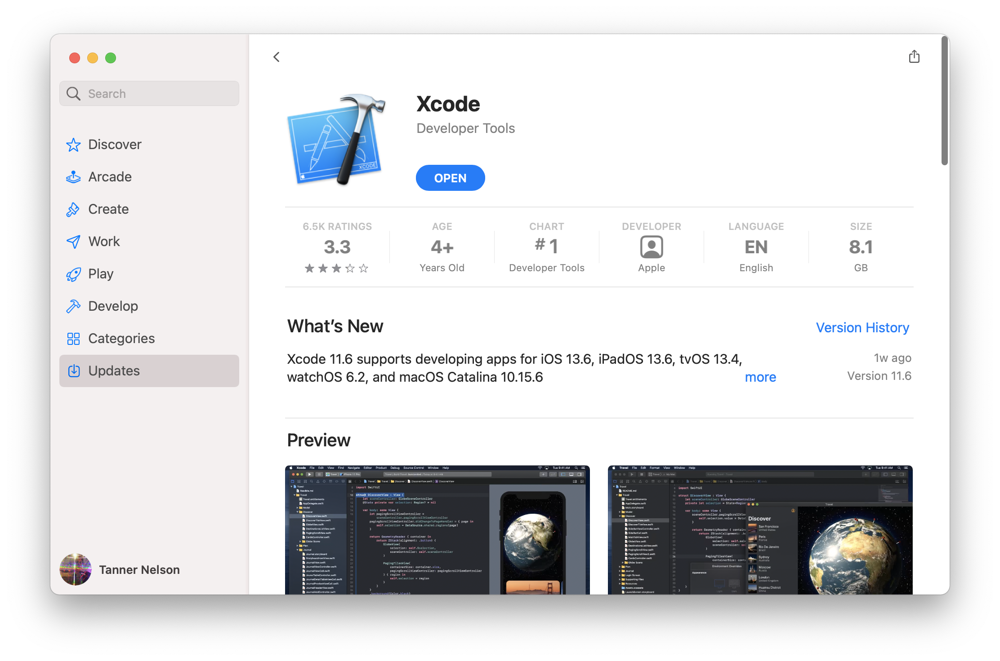

# Zainstaluj na macOS

Aby używać Vapor na macOS, potrzebujesz Swift w wersji 5.9 lub wyższej. Swift oraz wszystkie jego zależności są częścią instalacji Xcode.

## Zainstaluj Xcode

Zainstaluj [Xcode](https://itunes.apple.com/us/app/xcode/id497799835?mt=12) z Mac App Store.



Po tym jak Xcode będzie już pobrany, musi go otworzyć aby skończyć instalacje. To może chwilę zająć.

Dwa razy sprawdź aby upewnić się że instalacja była sukcesem otwierając Terminal i wyświetlając wersję Swifta.

```sh
swift --version
```

Powinna wyświetlić się wersja Swifta.

```sh
swift-driver version: 1.75.2 Apple Swift version 5.8 (swiftlang-5.8.0.124.2 clang-1403.0.22.11.100)
Target: arm64-apple-macosx13.0
```

Vapor 4 wymaga wersji Swifta 5.9 lub wyższej.

## Zainstaluj Toolbox

Teraz gdy masz już zainstalowanego Swifta, zainstalujmy [Vapor Toolbox](https://github.com/vapor/toolbox). Jest to narzędzie CLI (z ang. Command Line Interface), które nie jest potrzebne by używać Vapora, natomiast jest wyposażone w przydatne usprawnienia takie jak kreator nowego projektu.

### Homebrew

Toolbox jest wydawany przy pomocy Homebrew. Jeśli jeszcze nie masz Homebrew, to zajrzyj na <a href="https://brew.sh" target="_blank">brew.sh</a> po instrukcje jak zainstalować.

```sh
brew install vapor
```

Sprawdź dwa razy czy instalacja przeszła poprawnie po przez wyświetlenie pomocy.

```sh
vapor --help
```

Powinna być widoczna lista dostępnych komend.

### Makefile

Jeśli chcesz, możesz również zbudować Toolbox ze źródeł. Zobacz <a href="https://github.com/vapor/toolbox/releases" target="_blank">wydania</a> Toolbox na GitHubie, aby znaleźć najnowszą wersję.

```sh
git clone https://github.com/vapor/toolbox.git
cd toolbox
git checkout <desired version>
make install
```

Sprawdź dwa razy czy instalacja przeszła poprawnie po przez wyświetlenie pomocy.

```sh
vapor --help
```

Powinna być widoczna lista dostępnych komend.

## Następnie

Kiedy już udało Ci się zainstalować Swifta i Vapor Toolbox, stwórz swoja pierwszą aplikacje w sekcji [Pierwsze kroki &rarr; Witaj, świecie](../getting-started/hello-world.md).
