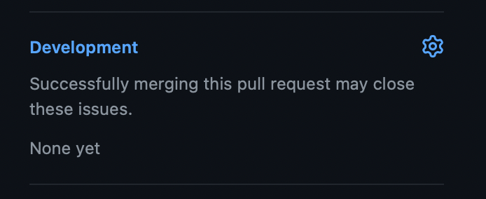

# Colaborar con Vapor

Vapor es un proyecto impulsado por la comunidad y las contribuciones de los miembros constituyen una parte importante de su desarrollo. Esta guía te ayudará a comprender el proceso de colaboración y a realizar tus primeros commits en Vapor.

¡Cualquier aporte que hagas es útil! Incluso cosas pequeñas como corregir errores tipográficos marcan una gran diferencia para las personas que usan Vapor.

## Código de Conducta

Vapor ha adoptado el Código de Conducta de Swift, que se puede encontrar en [https://www.swift.org/code-of-conduct/](https://www.swift.org/code-of-conduct/). Se espera que todos los colaboradores sigan este código de conducta.

## ¿En que trabajar?

Decidir en qué trabajar puede ser un gran obstáculo cuando se trata de comenzar con el código abierto. Por lo general, las mejores cosas en las que trabajar son los problemas que encuentres o las funciones que desees. Sin embargo, Vapor tiene algunas cosas útiles que te ayudarán a colaborar.

### Problemas de Seguridad

Si descubres un problema de seguridad y deseas informarlo o ayudar a solucionarlo, **no** plantees un issue ni crees un pull request. Contamos con un proceso separado para problemas de seguridad para garantizar que no expongamos vulnerabilidades hasta que haya una solución disponible. Envía un correo electrónico a security@vapor.codes o [consulta aquí](https://github.com/vapor/.github/blob/main/SECURITY.md) para obtener más detalles.

### Pequeños problemas

Si encuentras un pequeño problema, error o error tipográfico, no dudes en seguir adelante y crear una pull request para solucionarlo. Si soluciona un issue abierto en cualquiera de los repositorios, puedes vincularlo en la pull request en la barra lateral para que se cierre automáticamente cuando se hace el merge.

### Nuevas funcionalidades

Si deseas proponer cambios más importantes, como nuevas funcionalidades o correcciones de errores que cambian cantidades significativas de código, primero abre un issue o publícalo en el canal `#development` en Discord. Esto nos permite discutir el cambio contigo, ponerlo en contexto y ofrecerte sugerencias. ¡No queremos que pierdas el tiempo si una función no encaja con nuestros planes!

### Tableros de Vapor

Si solo quieres contribuir pero no tienes idea de en qué trabajar, ¡eso es fantástico! Vapor tiene un par de tableros que pueden ayudar. Vapor tiene alrededor de 40 repositorios que se desarrollan activamente y revisarlos todos para encontrar algo en lo que trabajar no es práctico, por lo que usamos tableros para organizar dichas tareas.

El primer tablero es el [tablero de good first issue](https://github.com/orgs/vapor/projects/14). Cualquier problema en la organización GitHub de Vapor que esté etiquetado como `good first issue` se agregará al tablero para que lo encuentres. Estos son temas que creemos que serán buenos para que trabajen las personas relativamente nuevas en Vapor, ya que no requieren mucha experiencia con el código.

El segundo tablero es el [tablero de help wanted](https://github.com/orgs/vapor/projects/13). Esto genera issues etiquetados como `help wanted`. Estos son problemas que podrían solucionarse, pero el equipo central actualmente tiene otras prioridades. Estos problemas generalmente requieren un poco más de conocimiento si no están marcados con `good first issue`, ¡pero podrían ser proyectos divertidos en los que trabajar!

### Traducciones

El último ámbito donde las contribuciones son extremadamente valiosas es la documentación. La documentación tiene traducciones para varios idiomas, pero no todas las páginas están traducidas y hay muchos más idiomas que nos gustaría disponer. Si estás interesado en contribuir con nuevos idiomas o actualizaciones, consulta el [README de los docs](https://github.com/vapor/docs#translating) o comunícate en el canal `#documentation` en Discord.

## Proceso de Colaboración

Si nunca has trabajado en un proyecto de código abierto, los pasos para colaborar pueden resultar confusos, pero son bastante simples.

Primero, haz un fork de Vapor o cualquier repositorio en el que quieras trabajar. Puedes hacer esto en la UI de GitHub y GitHub tiene [algunos documentos excelentes](https://docs.github.com/es/get-started/quickstart/fork-a-repo) sobre cómo hacer esto.

Luego puede realizar cambios en tu fork con el proceso habitual de commit y push. Una vez que estés listo para enviar tu solución, puedes crear una PR en el repositorio de Vapor. Nuevamente, GitHub tiene [documentos excelentes](https://docs.github.com/es/pull-requests/collaborating-with-pull-requests/proposing-changes-to-your-work-with-pull-requests/creating-a-pull-request-from-a-fork) sobre cómo hacer esto.

## Enviar una Pull Request

Al enviar una pull request, hay varias cosas que debes verificar:

* Todos los tests pasan
* Se agregaron nuevos tests para cualquier comportamiento nuevo o errores corregidos
* Se documentan nuevas APIs públicas. Usamos DocC para documentar nuestra API.

Vapor utiliza la automatización para reducir la cantidad de trabajo necesario para muchas tareas. Para las pull requests, utilizamos [Vapor Bot](https://github.com/VaporBot) para generar actualizaciones cuando se fusiona una pull request. El cuerpo y el título de la pull request se utilizan para generar las notas de la nueva versión, así que asegúrate de que tengan sentido y cubran lo que esperarías ver en las notas de la nueva versión. Tenemos más detalles sobre las [directrices de colaboración en Vapor](https://github.com/vapor/vapor/blob/main/.github/contributing.md#release-title).
