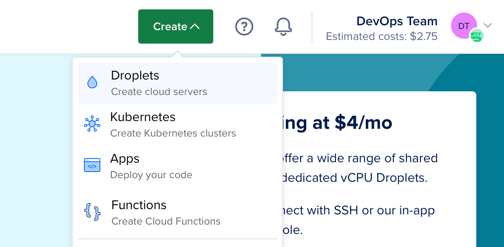

# Despliegue en DigitalOcean

Esta guía te mostrará cómo desplegar una aplicación simple "Hola mundo" de Vapor en un [Droplet](https://www.digitalocean.com/products/droplets/). Para seguir esta guía, debes tener una cuenta de [DigitalOcean](https://www.digitalocean.com) con la facturación configurada.

## Crear Servidor

Comencemos por instalar Swift en un servidor Linux. Usa el menú de creación para crear un nuevo Droplet.



En distribuciones, selecciona Ubuntu 22.04 LTS. La siguiente guía utilizará esta versión como ejemplo.


!!! note "Nota"
	Puedes seleccionar cualquier distribución de Linux con una versión compatible con Swift. Puedes consultar qué sistemas operativos son compatibles oficialmente en la página [Versiones de Swift](https://swift.org/download/#releases).

Después de seleccionar la distribución, elije el plan y la región del centro de datos que prefieras. Luego, configura una clave SSH para acceder al servidor después de que se cree. Finalmente, haz clic en crear Droplet y espera a que se inicie el nuevo servidor.

Cuando el nuevo servidor esté listo, pasa el cursor sobre la dirección IP del Droplet y haz clic en copiar.


## Configuración Inicial

Abre tu terminal y conéctate al servidor como root usando SSH.

```sh
ssh root@your_server_ip
```

DigitalOcean tiene una guía detallada para la [configuración inicial del servidor en Ubuntu 22.04](https://www.digitalocean.com/community/tutorials/initial-server-setup-with-ubuntu-22-04). Esta guía cubrirá rápidamente los conceptos básicos.

### Configurar el Firewall

Permitir OpenSSH a través del firewall y habilitarlo.

```sh
ufw allow OpenSSH
ufw enable
```

### Añadir Usuario

Crea un nuevo usuario además de `root`. Esta guía llama al nuevo usuario `vapor`.

```sh
adduser vapor
```

Permite que el usuario recién creado use `sudo`.

```sh
usermod -aG sudo vapor
```

Copia las claves SSH autorizadas del usuario root al usuario recién creado. Esto te permitirá ingresar por SSH como el nuevo usuario.

```sh
rsync --archive --chown=vapor:vapor ~/.ssh /home/vapor
```

Finalmente, sal de la sesión SSH actual e inicia sesión como el usuario recién creado.

```sh
exit
ssh vapor@your_server_ip
```

## Instalar Swift

Ahora que has creado un nuevo servidor Ubuntu y has iniciado sesión como usuario no root, puedes instalar Swift.

### Instalación automática con la herramienta Swiftly CLI (recomendada)

Visita el [sitio web de Swiftly](https://swiftlang.github.io/swiftly/) para obtener instrucciones sobre cómo instalar Swiftly y Swift en Linux. Después de eso, instala Swift con el siguiente comando:

#### Uso Básico

```sh
$ swiftly install latest

Fetching the latest stable Swift release...
Installing Swift 5.9.1
Downloaded 488.5 MiB of 488.5 MiB
Extracting toolchain...
Swift 5.9.1 installed successfully!

$ swift --version

Swift version 5.9.1 (swift-5.9.1-RELEASE)
Target: x86_64-unknown-linux-gnu
```

## Instalar Vapor con Vapor Toolbox

Ahora que Swift está instalado, instalemos Vapor con Vapor Toolbox. Necesitarás compilar la toolbox desde el código fuente. Consulta las [versiones](https://github.com/vapor/toolbox/releases) de la toolbox en GitHub para encontrar la última versión. En este ejemplo, estamos usando 18.6.0.

### Clonar y Compilar Vapor

Clona el repositorio de Vapor Toolbox.

```sh
git clone https://github.com/vapor/toolbox.git
```

Consulta la última versión.

```sh
cd toolbox
git checkout 18.6.0
```

Compila Vapor y mueve el binario a tu ruta.

```sh
swift build -c release --disable-sandbox --enable-test-discovery
sudo mv .build/release/vapor /usr/local/bin
```

### Crear un Proyecto Vapor

Utiliza el nuevo comando de proyecto de la toolbox para iniciar un proyecto.

```sh
vapor new HelloWorld -n
```

!!! tip "Consejo"
	El indicador `-n` brinda una plantilla básica al responder automáticamente no a todas las preguntas.


Una vez que finalice el comando, cambia a la carpeta recién creada:

```sh
cd HelloWorld
``` 

### Abrir Puerto HTTP

Para acceder a Vapor en tu servidor, abre un puerto HTTP.

```sh
sudo ufw allow 8080
```

### Ejecutar

Ahora que Vapor está configurado y tenemos un puerto abierto, ejecutémoslo.

```sh
swift run App serve --hostname 0.0.0.0 --port 8080
```

Visita la IP de tu servidor a través del navegador o terminal local y deberías ver "¡Funciona!". La dirección IP es `134.122.126.139` en este ejemplo.

```
$ curl http://134.122.126.139:8080
It works!
```

De vuelta a tu servidor, deberías ver los registros de la solicitud de prueba.

```
[ NOTICE ] Server starting on http://0.0.0.0:8080
[ INFO ] GET /
```

Usa `CTRL+C` para salir del servidor. Puede tomar un segundo apagarlo.

¡Felicitaciones por hacer que tu aplicación Vapor funcione en un Droplet de DigitalOcean!

## Próximos Pasos

El resto de esta guía indica recursos adicionales para mejorar tu despliegue.

### Supervisor

Supervisor es un sistema de control de procesos que puedes ejecutar y monitorear tu ejecutable de Vapor. Con la configuración de Supervisor, tu aplicación puede iniciarse automáticamente cuando se inicia el servidor y reiniciarse en caso de que falle. Obten más información sobre [Supervisor](../deploy/supervisor.md).

### Nginx

Nginx es un servidor y proxy HTTP extremadamente rápido, probado en batalla y fácil de configurar. Si bien Vapor admite el servicio directo de solicitudes HTTP, el proxy detrás de Nginx puede proporcionar un mayor rendimiento, seguridad y facilidad de uso. Obten más información sobre [Nginx](../deploy/nginx.md).
