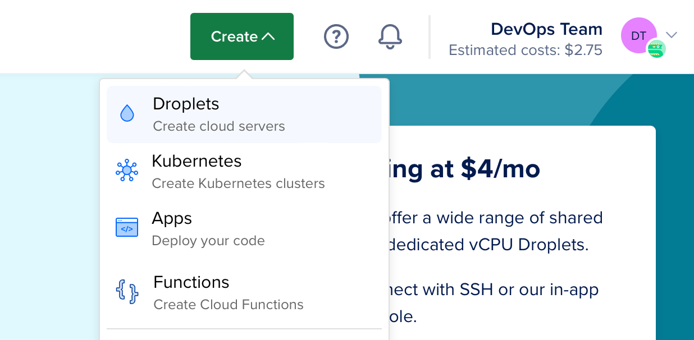
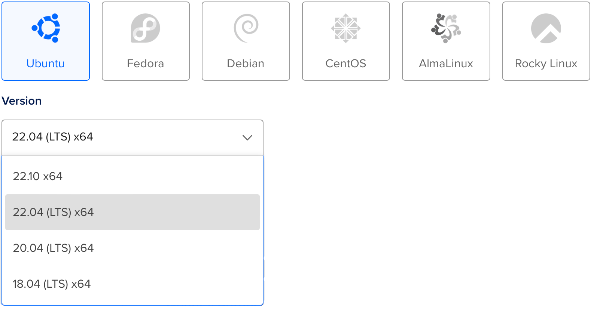
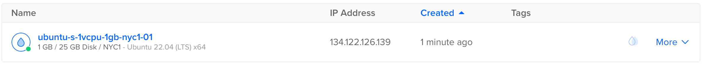
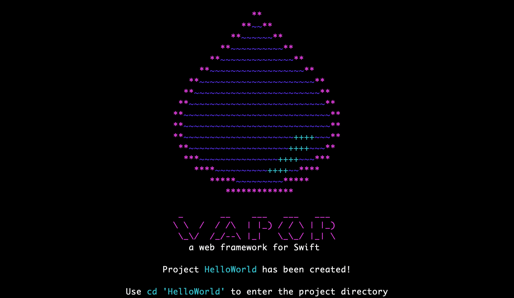

# DigitalOceanへのデプロイ {#deploying-to-digitalocean}

このガイドでは、シンプルなHello, world Vaporアプリケーションを[Droplet](https://www.digitalocean.com/products/droplets/)にデプロイする方法を説明します。このガイドに従うには、請求設定が完了した[DigitalOcean](https://www.digitalocean.com)アカウントが必要です。

## サーバーの作成 {#create-server}

まずはLinuxサーバーにSwiftをインストールしましょう。作成メニューを使用して新しいDropletを作成します。



ディストリビューションでUbuntu 22.04 LTSを選択します。以下のガイドではこのバージョンを例として使用します。



!!! note 
	Swiftがサポートするバージョンの任意のLinuxディストリビューションを選択できます。公式にサポートされているオペレーティングシステムは[Swift Releases](https://swift.org/download/#releases)ページで確認できます。

ディストリビューションを選択した後、お好みのプランとデータセンターのリージョンを選択します。次に、作成後にサーバーにアクセスするためのSSHキーを設定します。最後に、Dropletを作成をクリックして、新しいサーバーが起動するのを待ちます。

新しいサーバーの準備ができたら、DropletのIPアドレスにカーソルを合わせてコピーをクリックします。



## 初期設定 {#initial-setup}

ターミナルを開き、SSHを使用してrootとしてサーバーに接続します。

```sh
ssh root@your_server_ip
```

DigitalOceanには[Ubuntu 22.04の初期サーバー設定](https://www.digitalocean.com/community/tutorials/initial-server-setup-with-ubuntu-22-04)に関する詳細なガイドがあります。このガイドでは基本的な内容を簡単に説明します。

### ファイアウォールの設定 {#configure-firewall}

OpenSSHをファイアウォール経由で許可し、有効にします。

```sh
ufw allow OpenSSH
ufw enable
```

### ユーザーの追加 {#add-user}

`root`以外の新しいユーザーを作成します。このガイドでは新しいユーザーを`vapor`と呼びます。

```sh
adduser vapor
```

新しく作成したユーザーが`sudo`を使用できるようにします。

```sh
usermod -aG sudo vapor
```

rootユーザーの認証済みSSHキーを新しく作成したユーザーにコピーします。これにより、新しいユーザーとしてSSH接続できるようになります。

```sh
rsync --archive --chown=vapor:vapor ~/.ssh /home/vapor
```

最後に、現在のSSHセッションを終了し、新しく作成したユーザーとしてログインします。

```sh
exit
ssh vapor@your_server_ip
```

## Swiftのインストール {#install-swift}

新しいUbuntuサーバーを作成し、非rootユーザーとしてログインしたので、Swiftをインストールできます。

### Swiftly CLIツールを使用した自動インストール（推奨） {#automated-installation-using-swiftly-cli-tool-recommended}

[Swiftlyウェブサイト](https://swiftlang.github.io/swiftly/)にアクセスして、LinuxでSwiftlyとSwiftをインストールする方法の手順を確認してください。その後、次のコマンドでSwiftをインストールします：

#### 基本的な使い方 {#basic-usage}

```sh
$ swiftly install latest

Fetching the latest stable Swift release...
Installing Swift 5.9.1
Downloaded 488.5 MiB of 488.5 MiB
Extracting toolchain...
Swift 5.9.1 installed successfully!

$ swift --version

Swift version 5.9.1 (swift-5.9.1-RELEASE)
Target: x86_64-unknown-linux-gnu
```

## Vapor Toolboxを使用したVaporのインストール {#install-vapor-using-the-vapor-toolbox}

Swiftがインストールされたので、Vapor Toolboxを使用してVaporをインストールしましょう。toolboxをソースからビルドする必要があります。GitHubでtoolboxの[releases](https://github.com/vapor/toolbox/releases)を確認して最新バージョンを見つけてください。この例では、18.6.0を使用しています。

### Vaporのクローンとビルド {#clone-and-build-vapor}

Vapor Toolboxリポジトリをクローンします。

```sh
git clone https://github.com/vapor/toolbox.git
```

最新のリリースをチェックアウトします。

```sh
cd toolbox
git checkout 18.6.0
```

Vaporをビルドして、バイナリをパスに移動します。

```sh
swift build -c release --disable-sandbox --enable-test-discovery
sudo mv .build/release/vapor /usr/local/bin
```

### Vaporプロジェクトの作成 {#create-a-vapor-project}

Toolboxの新規プロジェクトコマンドを使用してプロジェクトを初期化します。

```sh
vapor new HelloWorld -n
```

!!! tip
	`-n`フラグは、すべての質問に自動的にnoと答えることで、最小限のテンプレートを提供します。



コマンドが完了したら、新しく作成されたフォルダに移動します：

```sh
cd HelloWorld
``` 

### HTTPポートを開く {#open-http-port}

サーバー上のVaporにアクセスするために、HTTPポートを開きます。

```sh
sudo ufw allow 8080
```

### 実行 {#run}

Vaporがセットアップされ、ポートが開いたので、実行してみましょう。

```sh
swift run App serve --hostname 0.0.0.0 --port 8080
```

ブラウザまたはローカルターミナルからサーバーのIPにアクセスすると、「It works!」が表示されるはずです。この例ではIPアドレスは`134.122.126.139`です。

```
$ curl http://134.122.126.139:8080
It works!
```

サーバーに戻ると、テストリクエストのログが表示されているはずです。

```
[ NOTICE ] Server starting on http://0.0.0.0:8080
[ INFO ] GET /
```

`CTRL+C`を使用してサーバーを終了します。シャットダウンには少し時間がかかる場合があります。

DigitalOcean DropletでVaporアプリが実行できたことをおめでとうございます！

## 次のステップ {#next-steps}

このガイドの残りの部分では、デプロイメントを改善するための追加リソースを紹介します。

### Supervisor {#supervisor}

Supervisorは、Vapor実行ファイルを実行および監視できるプロセス制御システムです。Supervisorを設定すると、サーバーの起動時にアプリが自動的に開始され、クラッシュした場合に再起動されます。[Supervisor](../deploy/supervisor.md)について詳しく学びましょう。

### Nginx {#nginx}

Nginxは、極めて高速で、実戦で証明されており、設定が簡単なHTTPサーバーおよびプロキシです。VaporはHTTPリクエストを直接処理することをサポートしていますが、Nginxの背後でプロキシすることで、パフォーマンス、セキュリティ、使いやすさが向上します。[Nginx](../deploy/nginx.md)について詳しく学びましょう。