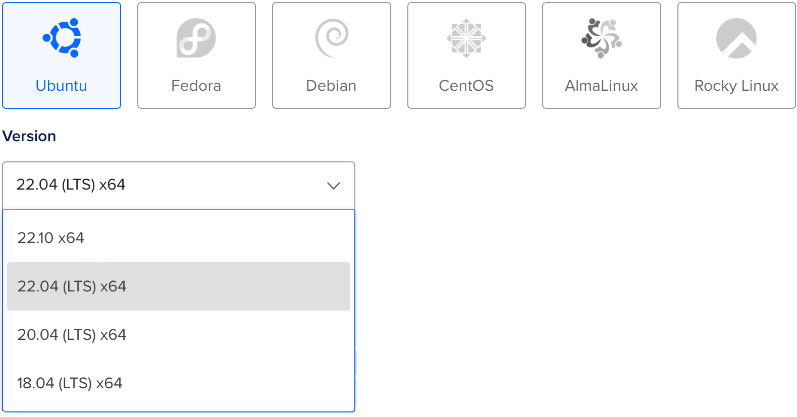

# Deploying to DigitalOcean

This guide will walk you through deploying a simple Hello, world Vapor application to a [Droplet](https://www.digitalocean.com/products/droplets/). To follow this guide, you must have a [DigitalOcean](https://www.digitalocean.com) account with billing configured.

## Create Server

Let's start by installing Swift on a Linux server. Use the create menu to create a new Droplet.


Under distributions, select Ubuntu 22.04 LTS. The following guide will use this version as an example.



!!! note 
	You may select any Linux distribution with a version that Swift supports. At the time of writing, Swift 5.7.3 supports Ubuntu 18.04, 20.04, 22.04, CentOS 7, and Amazon Linux 2. You can check which operating systems are officially supported on the [Swift Releases](https://swift.org/download/#releases) page.

After selecting the distribution, choose any plan and datacenter region you prefer. Then setup an SSH key to access the server after it is created. Finally, click create Droplet and wait for the new server to spin up.

Once the new server is ready, hover over the Droplet's IP address and click copy.


## Initial Setup

Open your terminal and connect to the server as root using SSH.

```sh
ssh root@your_server_ip
```

DigitalOcean has an in-depth guide for [initial server setup on Ubuntu 22.04](https://www.digitalocean.com/community/tutorials/initial-server-setup-with-ubuntu-22-04). This guide will quickly cover the basics.

### Configure Firewall

Allow OpenSSH through the firewall and enable it.

```sh
ufw allow OpenSSH
ufw enable
```

### Add User

Create a new user besides `root`. This guide calls the new user `vapor`.

```sh
adduser vapor
```

Allow the newly created user to use `sudo`.

```sh
usermod -aG sudo vapor
```

Copy the root user's authorized SSH keys to the newly created user. This will allow you to SSH in as the new user.

```sh
rsync --archive --chown=vapor:vapor ~/.ssh /home/vapor
```

Finally, exit the current SSH session and login as the newly created user. 

```sh
exit
ssh vapor@your_server_ip
```

## Install Swift

Now that you've created a new Ubuntu server and logged in as a non-root user you can install Swift. 

### Automated installation using Swiftly CLI tool (recommended)

Visit the [Swiflty website](https://swift-server.github.io/swiftly/) for instructions on how to install Swiftly and Swift on Linux. After that, install Swift with the following command:

#### Basic usage

```sh
$ swiftly install latest

Fetching the latest stable Swift release...
Installing Swift 5.8.1
Downloaded 488.5 MiB of 488.5 MiB
Extracting toolchain...
Swift 5.8.1 installed successfully!

$ swift --version

Swift version 5.8.1 (swift-5.8.1-RELEASE)
Target: x86_64-unknown-linux-gnu
```

## Install Vapor Using the Vapor Toolbox

Now that Swift is installed, let's install Vapor using the Vapor Toolbox. You will need to build the toolbox from source. View the toolbox's [releases](https://github.com/vapor/toolbox/releases) on GitHub to find the latest version. In this example, we are using 18.6.0.

### Clone and Build Vapor

Clone the Vapor Toolbox repository.

```sh
git clone https://github.com/vapor/toolbox.git
```

Checkout the latest release.

```sh
cd toolbox
git checkout 18.6.0
```

Build Vapor and move the binary into your path.

```sh
swift build -c release --disable-sandbox --enable-test-discovery
sudo mv .build/release/vapor /usr/local/bin
```

### Create a Vapor Project

Use the Toolbox's new project command to initiate a project.

```sh
vapor new HelloWorld -n
```

!!! tip
	The `-n` flag gives you a bare bones template by automatically answering no to all questions.


Once the command finishes, change into the newly created folder:

```sh
cd HelloWorld
``` 

### Open HTTP Port

In order to access Vapor on your server, open an HTTP port.

```sh
sudo ufw allow 8080
```

### Run

Now that Vapor is setup and we have an open port, let's run it. 

```sh
swift run App serve --hostname 0.0.0.0 --port 8080
```

Visit your server's IP via browser or local terminal and you should see "It works!". The IP address is `134.122.126.139` in this example.

```
$ curl http://134.122.126.139:8080
It works!
```

Back on your server, you should see logs for the test request.

```
[ NOTICE ] Server starting on http://0.0.0.0:8080
[ INFO ] GET /
```

Use `CTRL+C` to quit the server. It may take a second to shutdown.

Congratulations on getting your Vapor app running on a DigitalOcean Droplet!

## Next Steps

The rest of this guide points to additional resources to improve your deployment. 

### Supervisor

Supervisor is a process control system that can run and monitor your Vapor executable. With supervisor setup, your app can automatically start when the server boots and be restarted in case it crashes. Learn more about [Supervisor](../deploy/supervisor.md).

### Nginx

Nginx is an extremely fast, battle tested, and easy-to-configure HTTP server and proxy. While Vapor supports directly serving HTTP requests, proxying behind Nginx can provide increased performance, security, and ease-of-use. Learn more about [Nginx](../deploy/nginx.md).
