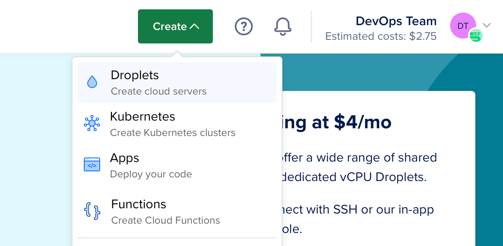
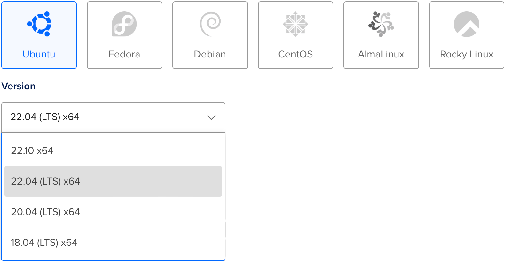
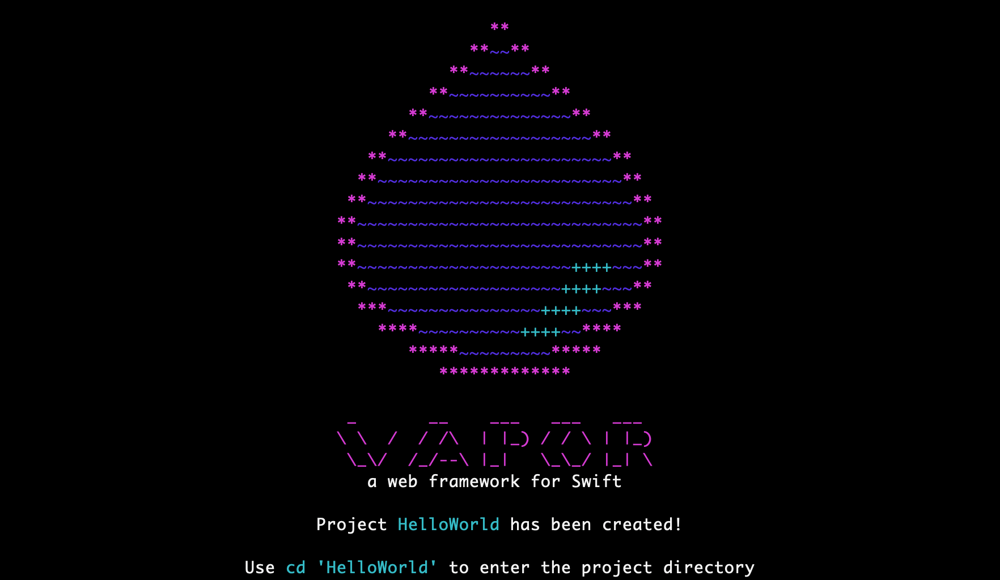

# Deploy no DigitalOcean

Este guia vai acompanhar você no processo de deploy de uma aplicação Vapor simples Hello, world em um [Droplet](https://www.digitalocean.com/products/droplets/). Para seguir este guia, você precisa ter uma conta no [DigitalOcean](https://www.digitalocean.com) com a cobrança configurada.

## Criar Servidor

Vamos começar instalando o Swift em um servidor Linux. Use o menu de criação para criar um novo Droplet.



Em distribuições, selecione Ubuntu 22.04 LTS. O guia a seguir usará esta versão como exemplo.



!!! note "Nota"
	Você pode selecionar qualquer distribuição Linux com uma versão que o Swift suporte. Você pode verificar quais sistemas operacionais são oficialmente suportados na página [Swift Releases](https://swift.org/download/#releases).

Após selecionar a distribuição, escolha qualquer plano e região de datacenter que preferir. Em seguida, configure uma chave SSH para acessar o servidor após a criação. Por fim, clique em criar Droplet e aguarde o novo servidor ser provisionado.

Quando o novo servidor estiver pronto, passe o mouse sobre o endereço IP do Droplet e clique em copiar.


## Configuração Inicial

Abra seu terminal e conecte-se ao servidor como root usando SSH.

```sh
ssh root@your_server_ip
```

O DigitalOcean tem um guia detalhado para [configuração inicial do servidor no Ubuntu 22.04](https://www.digitalocean.com/community/tutorials/initial-server-setup-with-ubuntu-22-04). Este guia vai cobrir rapidamente o básico.

### Configurar Firewall

Permita o OpenSSH através do firewall e habilite-o.

```sh
ufw allow OpenSSH
ufw enable
```

### Adicionar Usuário

Crie um novo usuário além do `root`. Este guia chama o novo usuário de `vapor`.

```sh
adduser vapor
```

Permita que o usuário recém-criado use o `sudo`.

```sh
usermod -aG sudo vapor
```

Copie as chaves SSH autorizadas do usuário root para o usuário recém-criado. Isso permitirá que você se conecte via SSH como o novo usuário.

```sh
rsync --archive --chown=vapor:vapor ~/.ssh /home/vapor
```

Por fim, saia da sessão SSH atual e faça login como o usuário recém-criado.

```sh
exit
ssh vapor@your_server_ip
```

## Instalar Swift

Agora que você criou um novo servidor Ubuntu e fez login como usuário não-root, você pode instalar o Swift.

### Instalação automatizada usando a ferramenta CLI Swiftly (recomendado)

Visite o [site do Swiftly](https://swiftlang.github.io/swiftly/) para instruções sobre como instalar o Swiftly e o Swift no Linux. Depois disso, instale o Swift com o seguinte comando:

#### Uso básico

```sh
$ swiftly install latest

Fetching the latest stable Swift release...
Installing Swift 5.9.1
Downloaded 488.5 MiB of 488.5 MiB
Extracting toolchain...
Swift 5.9.1 installed successfully!

$ swift --version

Swift version 5.9.1 (swift-5.9.1-RELEASE)
Target: x86_64-unknown-linux-gnu
```

## Instalar Vapor Usando o Vapor Toolbox

Agora que o Swift está instalado, vamos instalar o Vapor usando o Vapor Toolbox. Você precisará compilar o toolbox a partir do código-fonte. Veja os [releases](https://github.com/vapor/toolbox/releases) do toolbox no GitHub para encontrar a versão mais recente. Neste exemplo, estamos usando a 18.6.0.

### Clonar e Compilar o Vapor

Clone o repositório do Vapor Toolbox.

```sh
git clone https://github.com/vapor/toolbox.git
```

Faça checkout da versão mais recente.

```sh
cd toolbox
git checkout 18.6.0
```

Compile o Vapor e mova o binário para o seu path.

```sh
swift build -c release --disable-sandbox --enable-test-discovery
sudo mv .build/release/vapor /usr/local/bin
```

### Criar um Projeto Vapor

Use o comando de novo projeto do Toolbox para iniciar um projeto.

```sh
vapor new HelloWorld -n
```

!!! tip "Dica"
	A flag `-n` fornece um template básico respondendo automaticamente não para todas as perguntas.



Quando o comando terminar, entre na pasta recém-criada:

```sh
cd HelloWorld
```

### Abrir Porta HTTP

Para acessar o Vapor no seu servidor, abra uma porta HTTP.

```sh
sudo ufw allow 8080
```

### Executar

Agora que o Vapor está configurado e temos uma porta aberta, vamos executá-lo.

```sh
swift run App serve --hostname 0.0.0.0 --port 8080
```

Visite o IP do seu servidor pelo navegador ou terminal local e você deverá ver "It works!". O endereço IP é `134.122.126.139` neste exemplo.

```
$ curl http://134.122.126.139:8080
It works!
```

De volta ao seu servidor, você deverá ver logs da requisição de teste.

```
[ NOTICE ] Server starting on http://0.0.0.0:8080
[ INFO ] GET /
```

Use `CTRL+C` para encerrar o servidor. Pode levar um segundo para desligar.

Parabéns por ter sua aplicação Vapor rodando em um Droplet do DigitalOcean!

## Próximos Passos

O restante deste guia aponta para recursos adicionais para melhorar seu deploy.

### Supervisor

O Supervisor é um sistema de controle de processos que pode executar e monitorar seu executável Vapor. Com o Supervisor configurado, sua aplicação pode iniciar automaticamente quando o servidor inicializa e ser reiniciada em caso de falha. Saiba mais sobre o [Supervisor](../deploy/supervisor.md).

### Nginx

O Nginx é um servidor HTTP e proxy extremamente rápido, testado em batalha e fácil de configurar. Embora o Vapor suporte servir requisições HTTP diretamente, usar um proxy como o Nginx pode oferecer maior performance, segurança e facilidade de uso. Saiba mais sobre o [Nginx](../deploy/nginx.md).
