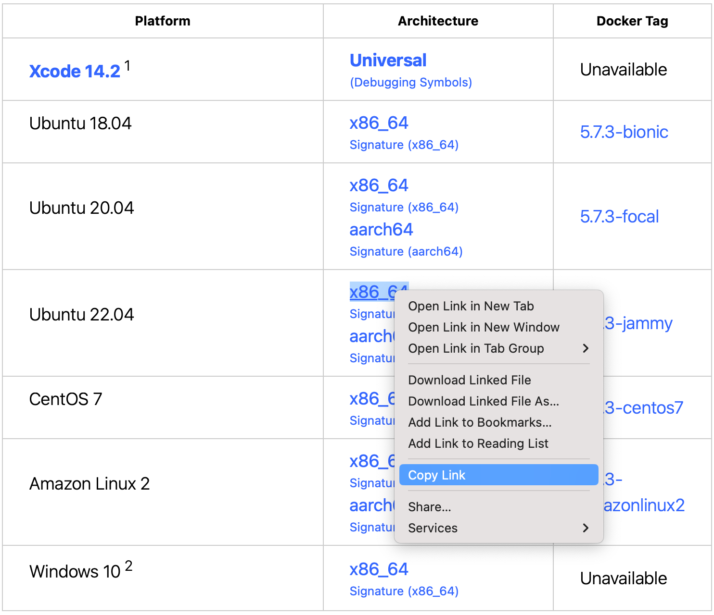

# 部署到 DigitalOcean

本指南将引导你将一个简单的 Hello, world Vapor 应用程序部署到 [Droplet](https://www.digitalocean.com/products/droplets/)。要遵循本指南，你需要有一个付费的 [DigitalOcean](https://www.digitalocean.com) 帐户。

## 创建服务器

让我们从在 Linux 服务器上安装 Swift 开始。 使用创建菜单创建一个新的 Droplet。


在发行版下，选择 Ubuntu 18.04 LTS。以下指南将以此版本为例。


!!! note "注意"  
	你也可以选择 Swift 支持的其它 Linux 发行版。在撰写本文时， Swift 5.2.4 支持 Ubuntu 16.04、18.04、20.04、CentOS 8, 和 Amazon Linux 2。你可以在 [Swift Releases](https://swift.org/download/#releases) 页面上查看官方支持哪些操作系统。

选择完发行版后，选择你喜欢的套餐和数据中心所在区域。然后设置一个 SSH 密钥以在创建服务器后访问它。最后， 点击创建 Droplet 并等待新服务器启动。

新服务器准备完毕后，鼠标悬停在 Droplet 的 IP 地址上，然后单击复制。


## 初始化设置

打开你的终端，使用 SSH 通过 root 身份登录到服务器。

```sh
ssh root@your_server_ip
```

在 [Ubuntu 18.04](https://www.digitalocean.com/community/tutorials/initial-server-setup-with-ubuntu-18-04) 上初始化服务器设置，DigitalOcean 提供了深入指南。 本指南将快速介绍一些基础知识。

### 配置防火墙

允许 OpenSSH 通过防火墙并且启用它。

```sh
ufw allow OpenSSH
ufw enable
```

### 添加用户

除了 `root` 用户在创建一个新用户。本指南创建了一个 `vapor` 用户。

```sh
adduser vapor
```

允许新创建的用户使用 `sudo`。

```sh
usermod -aG sudo vapor
```

复制 root 用户的 SSH 密钥到新创建的用户。允许新用户通过 SSH 登录。

```sh
rsync --archive --chown=vapor:vapor ~/.ssh /home/vapor
```

最后，退出当前 SSH 会话，用新创建的用户进行登录。

```sh
exit
ssh vapor@your_server_ip
```

## 安装 Swift

现在你已经创建了一个新的 Ubuntu 服务器并且通过非 root 身份登录到服务器，你可以安装 Swift。 

### Swift 依赖项

安装 Swift 所需要的依赖项。

```sh
sudo apt-get update
sudo apt-get install clang libicu-dev libatomic1 build-essential pkg-config
```

### 下载 Toolchain

本指南将安装 Swift 5.2.4。访问 [Swift Releases](https://swift.org/download/#releases) 页面获取最新版本的链接。复制 Ubuntu 18.04 的下载链接。



下载并解压 Swift toolchain。

```sh
wget https://swift.org/builds/swift-5.2.4-release/ubuntu1804/swift-5.2.4-RELEASE/swift-5.2.4-RELEASE-ubuntu18.04.tar.gz
tar xzf swift-5.2.4-RELEASE-ubuntu18.04.tar.gz
```

!!! note "注意" 
	Swift 的[使用下载指南](https://swift.org/download/#using-downloads)包含有关如何使用 PGP 签名验证下载的信息。

### 安装 Toolchain

将 Swift 移到易于访问的地方。本指南将 `/swift` 与子文件夹中的每个编译器版本一起使用。

```sh
sudo mkdir /swift
sudo mv swift-5.2.4-RELEASE-ubuntu18.04 /swift/5.2.4
```

将 Swift 添加到 `/usr/bin` 以便 `vapor` 和 `root` 用户可以执行。

```sh
sudo ln -s /swift/5.2.4/usr/bin/swift /usr/bin/swift
```

验证 Swift 是否正确安装。

```sh
swift --version
```

## 设置项目

现在已经安装了 Swift，让我们克隆并编译项目。本示例，我们使用 Vapor 的 [API 模板](https://github.com/vapor/api-template/)。

首先安装 Vapor 的系统依赖项。

```sh
sudo apt-get install openssl libssl-dev zlib1g-dev libsqlite3-dev
```

允许 HTTP 通过防火墙。

```sh
sudo ufw allow http
```

### 克隆和构建

现在克隆项目并构建它。

```sh
git clone https://github.com/vapor/api-template.git
cd api-template
swift build
```

!!! tip "建议" 
	如果生产环境进行构建， 请使用 `swift build -c release`

### 运行

项目编译完成后，在服务器的 IP 端口80上运行它。本示例的 IP 地址为 `157.245.244.228`。

```sh
sudo .build/debug/Run serve -b 157.245.244.228:80
```

如果你使用 `swift build -c release` 进行构建, 然后你需要运行：
```sh
sudo .build/release/Run serve -b 157.245.244.228:80
```

通过浏览器或者本地终端访问服务器的 IP， 你应该会看到 “It works!”。

```
$ curl http://157.245.244.228
It works!
```

回到服务器上，你应该会看到测试请求的日志。

```
[ NOTICE ] Server starting on http://157.245.244.228:80
[ INFO ] GET /
```

使用 `CTRL+C` 退出服务器。可能需要一秒钟才能关闭。

恭喜你的 Vapor 应用程序运行在 DigitalOcean Droplet 上了！

## 下一步

本指南的其余部分指向的资源用于改进你的部署。

### Supervisor

Supervisor 是一个进程控制系统，可以运行和监控你的 Vapor 可执行文件。通过设置 supervisor， 服务器启动时应用程序自动启动，并在崩溃是重新启动。了解有关 [Supervisor](../deploy/supervisor.md) 的更多信息。

### Nginx

Nginx 是一个速度极快、经过实战考验并且易于配置的 HTTP 服务器和代理。虽然 Vapor 支持直接的 HTTP 请求，但 Nginx 背后的代理可以提供更高的性能、安全性和易用性。了解有关 [Nginx](../deploy/nginx.md) 的更多信息。
