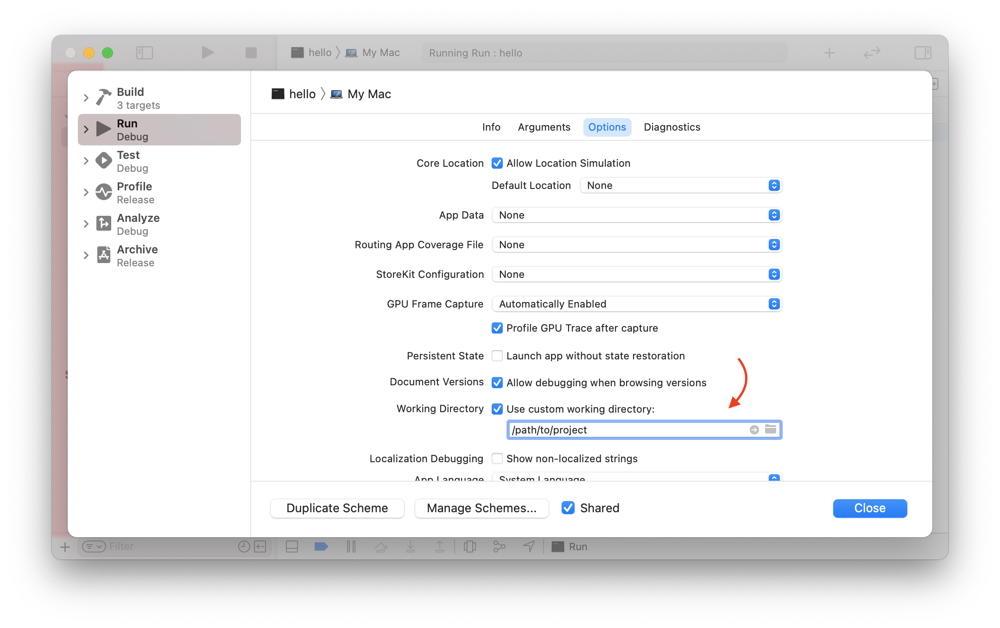

# Xcode

 Dieser Abschnitt geht auf Tipps und Tricks zur Verwendung von Vapor in Xcode ein. Solltest du eine andere Entwicklungsumgebung verwenden, kannst du natürlich den Abschnitt überspringen.

 ## Arbeitsverzeichnis

 Xcode greift standardmäßig auf den _Derived Data_-Ordner zu, weshalb Vapor den Ordner _Public_ oder die Datei mit den Umgebungsvariablen (.env) nicht ohne dein Zutun vorfinden kann.
 
 Xcode gibt daraufhin eine Fehlermeldung aus:

 ```
 [ WARNING ] No custom working directory set for this scheme, using /path/to/DerivedData/project-abcdef/Build/
 ```

 Um das Problem zu lösen, musst du Xcode erst das Arbeitsverzeichnis mitteilen.

 Rufe dazu den _Scheme Editor_ über die den Menüpunkte _Products > Scheme > Edit Scheme..._ auf und wähle im Editor das Schema _Run_ aus.
 
 Wähle in der rechten Fensterhälfte den Reiter _Options_ aus und gebe den Pfad zu deinem Projekt unter dem Punkt _Working Directory_ mit an.

 

 Für den Fall, dass du den Pfad zu deinem Projekt nicht kennst, kannst du mit Hilfe des Terminal-Befehls 'pwd' den Pfad ganz einfach herausfinden.

 ```
 # verify we are in vapor project folder
 vapor --version
 # get path to this folder
 pwd
 ```

 ```
 framework: 4.x.x
 toolbox: 18.x.x
 /path/to/project
 ```