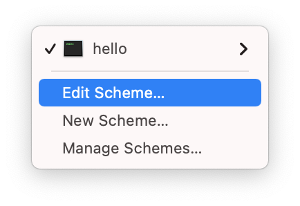

# Xcode

이 페이지에서는 Xcode를 사용하는 데 도움이 되는 팁에 대해 알려드립니다. 다른 개발 환경을 사용하는 경우 이 부분을 건너뛰어도 됩니다.

## Custom Working Directory

기본적으로 Xcode는 프로젝트를 DerivedData 폴더에서 실행합니다. 이 폴더는 프로젝트의 루트 폴더(즉, Package.swift 파일이 있는 곳)와 다른 폴더입니다. 따라서 Vapor는 .env 또는 _Public_과 같은 파일 및 폴더를 찾을 수 없게 됩니다.

앱을 실행할 때 다음 경고가 표시된다면 이런 상황이 발생하는 것입니다.

```fish
[ WARNING ] No custom working directory set for this scheme, using /path/to/DerivedData/project-abcdef/Build/
```

이를 해결하기 위해 Xcode scheme에서 custom working directory를 설정하세요.

먼저, 재생 및 중지 버튼 옆에 있는 scheme selector를 클릭하여 프로젝트의 scheme을 편집하세요.


Edit Scheme을 선택합니다.



scheme editor에서 Options탭을 선택한 후 Use custom working directory를 클릭한 후 프로젝트 루트폴더 경로를 설정합니다.


프로젝트의 루트 폴더의 전체 경로를 얻으려면 해당 위치에서 터미널 창을 열고 `pwd`를 실행하세요.

```sh
# get path to this folder
pwd
```

다음과 유사한 출력이 나타날 것입니다.

```
/path/to/project
```
