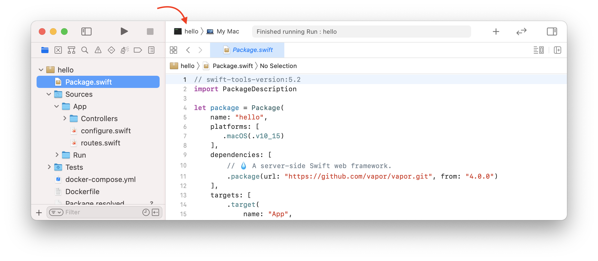

# Xcode

Deze pagina behandelt enkele tips en trucs voor het gebruik van Xcode. Als u een andere ontwikkelomgeving gebruikt, kunt u deze overslaan.

## Custom Working Directory

Standaard zal Xcode uw project uitvoeren vanuit de _DerivedData_ map. Deze map is niet hetzelfde als de hoofdmap van uw project (waar uw _Package.swift_ bestand staat). Dit betekent dat Vapor niet in staat zal zijn om bestanden en mappen zoals _.env_ of _Public_ te vinden.

U kunt zien dat dit gebeurt als u de volgende waarschuwing ziet wanneer u uw app uitvoert.

```fish
[ WARNING ] No custom working directory set for this scheme, using /path/to/DerivedData/project-abcdef/Build/
```

Om dit op te lossen, stelt u een aangepaste werkdirectory in het Xcode-schema in voor uw project.

Bewerk eerst het schema van uw project door te klikken op de schema selector bij de play en stop knoppen.



Selecteer _Edit Scheme..._ in de dropdown.


Kies in de schema editor de actie _App_ en het tabblad _Options_. Vink _Use custom working directory_ aan en voer het pad in naar de hoofdmap van uw project.


U kunt het volledige pad naar de root van uw project krijgen door `pwd` uit te voeren vanuit een terminal venster dat daar geopend is.

```sh
# haal het pad naar deze map op
pwd
```

U zou uitvoer moeten zien zoals hieronder.

```
/path/to/project
```
