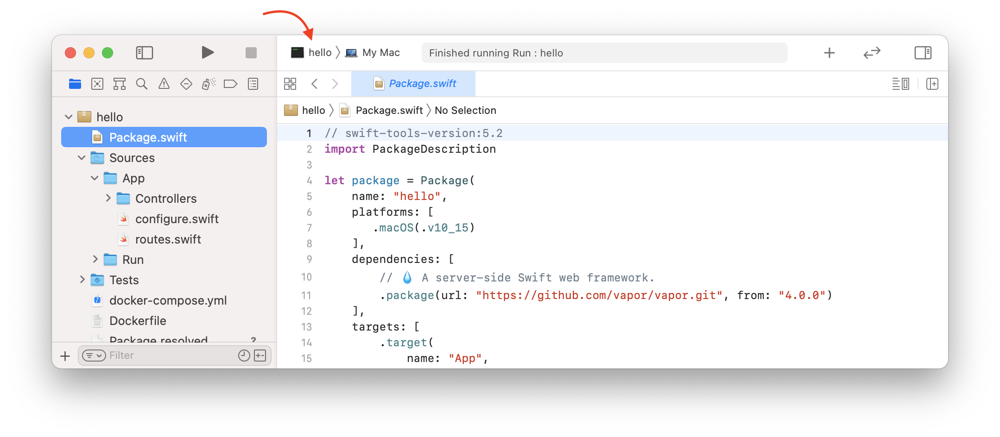
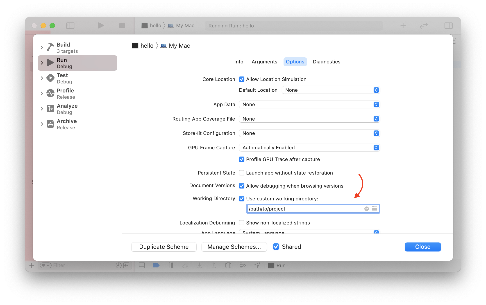

# Xcode

Ta strona zawiera wskazówki i porady dotyczące korzystania z Xcode. Jeśli korzystasz z innego środowiska programistycznego, możesz ją pominąć.

## Niestandardowy katalog roboczy

Domyślnie Xcode uruchamia projekt z folderu _DerivedData_. Folder ten nie jest taki sam jak folder główny projektu (gdzie znajduje się plik _Package.swift_). Oznacza to, że Vapor nie będzie w stanie znaleźć plików i folderów takich jak _.env_ lub _Public_.

Można to stwierdzić, jeśli podczas uruchamiania aplikacji pojawi się następujące ostrzeżenie. 

```fish
[ WARNING ] No custom working directory set for this scheme, using /path/to/DerivedData/project-abcdef/Build/
```

Aby to naprawić, ustaw niestandardowy katalog roboczy w schemacie Xcode dla swojego projektu. 

Najpierw edytuj schemat projektu, klikając selektor schematu przy przyciskach odtwarzania i zatrzymania. 



Wybierz _Edit Scheme..._ z listy rozwijanej.


W edytorze schematów wybierz akcję _App_ i zakładkę _Options_. Zaznacz opcję _Use custom working directory_ i wprowadź ścieżkę do folderu głównego projektu.



Możesz uzyskać pełną ścieżkę do katalogu głównego projektu, uruchamiając `pwd` z otwartego tam okna terminala.

```sh
# Uzyskaj ścieżkę do tego folderu
pwd
```

Powinieneś zobaczyć dane wyjściowe podobne do poniższych.

```
/path/to/project
```