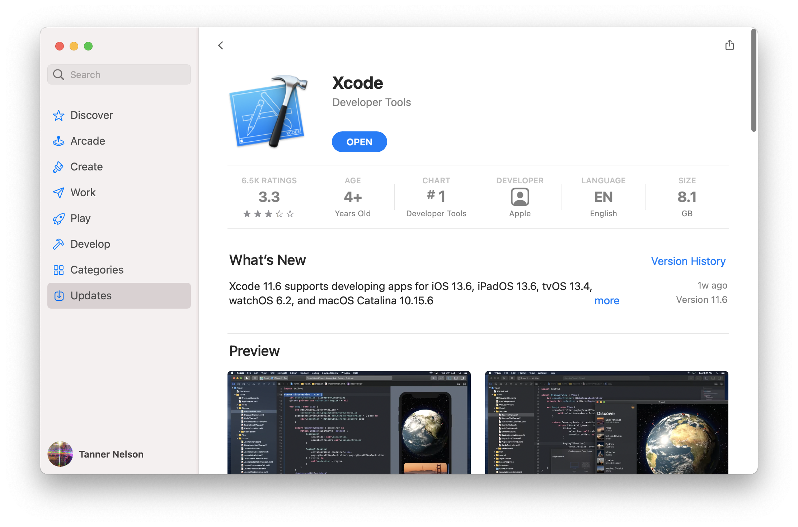

# Installation unter macOS

Die Mindestvoraussetzung für Vapor ist Swift 5.2 oder höher.

## Xcode-Installation

Xcode ist eine Entwicklungsumgebung von Apple. Du findest die App im [AppStore](https://itunes.apple.com/us/app/xcode/id497799835?mt=12). Mit der Installation von Xcode wird auch Swift installiert.



Sobald die App heruntergeladen ist, führe die Installation aus. Öffne nach der Installation Xcode um die Installation komplett abzuschließen. Mit dem Termin-Befehl `swift --version` kannst du nun überprüfen, ob die Installation von Swift erfolgreich verlief und welche Version installiert wurde.

```sh
swift --version

Apple Swift version 5.2 (swiftlang-1100.0.270.13 clang-1100.0.33.7)
Target: x86_64-apple-darwin19.0.0
```

## Toolbox-Installation

Neben Swift kannst du auch die Vapor-Toolbox installieren. Die Toolbox ist zwar für Vapor nicht zwingend notwendig, aber beinhaltet Befehle, die dich bei der Arbeit mit Vapor unterstützen.

Du kannst die Toolbox mittels [Homebrew](https://brew.sh) installieren:

```sh
brew install vapor
```

##

Nach den Installationen kannst du mit der Erstellung deiner ersten Vapor-Anwendung beginnen. Folge dazu den Anweisungen im Abschnitt [Erste Schritte → Hello, world](../getting-started/hello-world.md).
