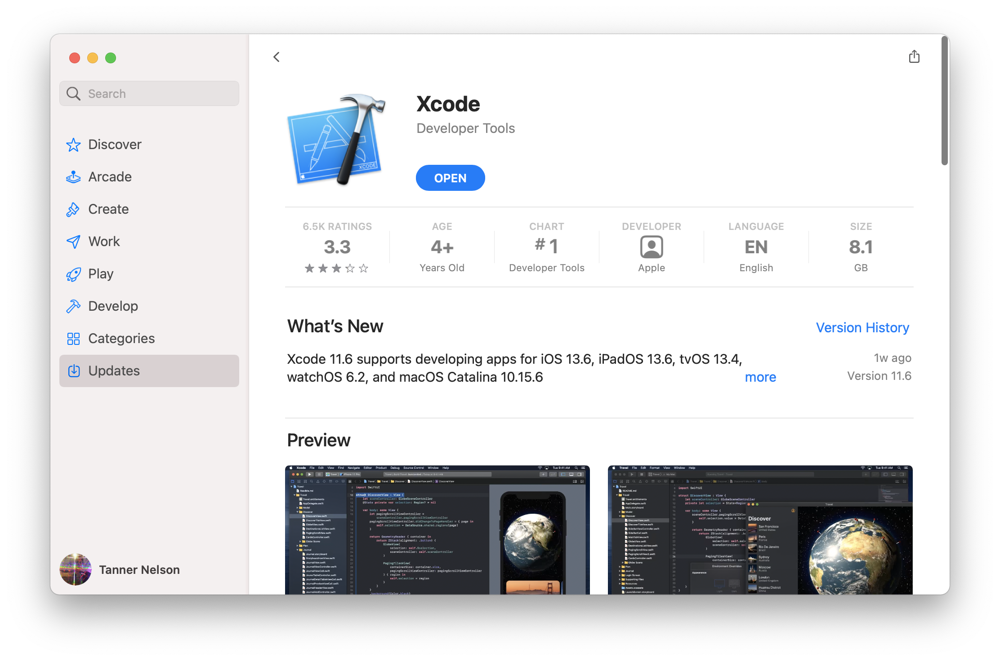

# Installazione su macOS

Per usare Vapor su macOS, avrai bisogno di Swift 5.9 o superiore. Swift e tutte le sue dipendenze vengono installati automaticamente quando si installa Xcode.

## Installare Xcode

Puoi installare Xcode dal [Mac App Store](https://apps.apple.com/us/app/xcode/id497799835?mt=12).



Dopo aver scaricato Xcode, dovrai aprirlo per completare l'installazione. Questo potrebbe richiedere un po' di tempo.

Controlla che l'installazione sia andata a buon fine aprendo il Terminale e stampando la versione di Swift.

```sh
swift --version
```

Dovresti vedere stampate le informazioni della versione di Swift:

```sh
swift-driver version: 1.75.2 Apple Swift version 5.8 (swiftlang-5.8.0.124.2 clang-1403.0.22.11.100)
Target: arm64-apple-macosx13.0
```

Vapor 4 richiede Swift 5.9 o superiore.

## Installare la Toolbox

Ora che hai installato Swift, puoi installare la [Vapor Toolbox](https://github.com/vapor/toolbox). Questo strumento da linea di comando non è necessario per usare Vapor, ma aiuta nella creazione dei progetti Vapor.

### Homebrew

La Toolbox è distribuita tramite Homebrew. Se non hai ancora Homebrew, visita <a href="https://brew.sh" target="_blank">brew.sh</a> per le istruzioni di installazione.

```sh
brew install vapor
```

Controlla che l'installazione sia andata a buon fine stampando l'aiuto.

```sh
vapor --help
```

Dovresti vedere una lista di comandi disponibili.

### Makefile

Se vuoi, puoi compilare la Toolbox dal codice sorgente. Guarda le <a href="https://github.com/vapor/toolbox/releases" target="_blank"> release </a> della Toolbox su GitHub per trovare l'ultima versione.

```sh
git clone https://github.com/vapor/toolbox.git
cd toolbox
git checkout <desired version>
make install
```

Controlla che l'installazione sia andata a buon fine stampando l'aiuto.

```sh
vapor --help
```

Dovresti vedere una lista di comandi disponibili.

## Come continuare

Dopo aver installato Swift e la Vapor Toolbox, puoi iniziare a creare il tuo primo progetto usando [Inizio &rarr; Ciao, mondo](../getting-started/hello-world.it.md).
